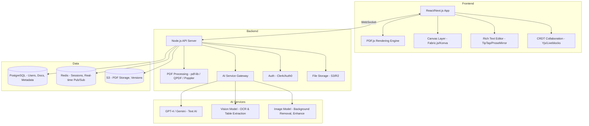

# 📝 PRD: ProPDF Editor — Advanced PDF Editing Platform

> **Version:** 1.0  
> **Date:** April 13, 2026  
> **Status:** Draft  
> **Author:** Product Team

---

## 1. 🎯 Vision & Overview

**ProPDF Editor** is a next-generation, browser-based PDF editing platform that goes far beyond what iLovePDF and competitors currently offer. It combines **AI-powered intelligence**, **real-time collaboration**, **advanced design tools**, and a **plugin ecosystem** — delivering a Figma-like experience for PDFs.

### Mission Statement
> *"Make PDF editing as intuitive as Google Docs, as powerful as Photoshop, and as intelligent as an AI assistant."*

---

## 2. 🔍 iLovePDF Edit PDF — Complete Function List

> [!NOTE]
> Below is **every function/tool** that iLovePDF's Edit PDF currently provides (verified April 2026). Our PRD must cover **ALL** of these + go significantly beyond.

### 2.1 iLovePDF Edit PDF — All Functions

#### A. Selection & Navigation Tools
| # | iLovePDF Function | What It Does |
|---|-------------------|--------------|
| A1 | **Selection Tool (Pointer)** | Select, move, resize any added element |
| A2 | **Page Thumbnails Sidebar** | Left sidebar showing preview thumbnails of all pages |
| A3 | **Jump to Page** | Navigate to a specific page number |
| A4 | **Zoom In / Zoom Out** | Zoom controls for precision editing |
| A5 | **Fit to Width / Fit to Page** | Quick zoom presets |
| A6 | **Undo / Redo** | Standard history management (Ctrl+Z / Ctrl+Y) |

#### B. Text Tools
| # | iLovePDF Function | What It Does |
|---|-------------------|--------------|
| B1 | **Edit Existing Text** | Click on original PDF text to modify it directly |
| B2 | **Add Text Box** | Insert new text anywhere on the document |
| B3 | **Font Selection** | Choose from web-safe fonts |
| B4 | **Font Size** | Adjust text size |
| B5 | **Font Color** | Color picker (palette + hex) |
| B6 | **Bold / Italic / Underline** | Basic text formatting |
| B7 | **Text Alignment** | Left, Center, Right, Justify |

#### C. Image Tools
| # | iLovePDF Function | What It Does |
|---|-------------------|--------------|
| C1 | **Add Image (Upload)** | Upload images (JPG, PNG, GIF) |
| C2 | **Resize Image** | Drag handles to resize |
| C3 | **Rotate Image** | Rotate uploaded images |
| C4 | **Image Transparency** | Adjust opacity of images |
| C5 | **Image Layer Order** | Bring to Front / Send to Back |

#### D. Shape Tools
| # | iLovePDF Function | What It Does |
|---|-------------------|--------------|
| D1 | **Rectangle** | Insert rectangle shape |
| D2 | **Ellipse / Circle** | Insert ellipse/circle shape |
| D3 | **Straight Line** | Insert straight line |
| D4 | **Arrow** | Insert arrow line |
| D5 | **Shape Fill Color** | Set fill color for shapes |
| D6 | **Shape Border / Stroke** | Set border color and thickness |
| D7 | **Shape Transparency** | Adjust opacity of shapes |
| D8 | **Shape Resize & Rotate** | Resize and rotate shapes |

#### E. Drawing & Annotation Tools
| # | iLovePDF Function | What It Does |
|---|-------------------|--------------|
| E1 | **Freehand Drawing (Pencil)** | Draw freely on the PDF |
| E2 | **Pencil Color** | Choose drawing color |
| E3 | **Pencil Thickness** | Adjust line thickness |
| E4 | **Pencil Opacity** | Adjust drawing transparency |
| E5 | **Highlight Text** | Highlight existing text (marker effect) |
| E6 | **Underline Text** | Underline existing text |
| E7 | **Strikethrough Text** | Cross out existing text |

#### F. Symbols & Extras
| # | iLovePDF Function | What It Does |
|---|-------------------|--------------|
| F1 | **Emoji / Symbols Library** | Insert emojis and symbols |
| F2 | **Add Links** | Insert hyperlinks into the PDF |
| F3 | **Add Bookmarks** | Add navigation bookmarks |
| F4 | **Add Attachments** | Embed file attachments inside the PDF |

#### G. Form & Signature
| # | iLovePDF Function | What It Does |
|---|-------------------|--------------|
| G1 | **Text Input Field** | Add fillable text field |
| G2 | **Checkbox** | Add checkboxes |
| G3 | **Radio Button** | Add radio button groups |
| G4 | **Signature Field** | Add signature area |
| G5 | **Fill Existing Forms** | Fill in existing interactive PDF forms |

#### H. Layer Management
| # | iLovePDF Function | What It Does |
|---|-------------------|--------------|
| H1 | **Bring to Front** | Move element to top layer |
| H2 | **Send to Back** | Move element to bottom layer |
| H3 | **Basic Layer Ordering** | Rearrange element stacking |

#### I. File & Cloud
| # | iLovePDF Function | What It Does |
|---|-------------------|--------------|
| I1 | **Upload from Computer** | Drag-and-drop or browse upload |
| I2 | **Import from Google Drive** | Import PDF from Google Drive |
| I3 | **Import from Dropbox** | Import PDF from Dropbox |
| I4 | **Download Edited PDF** | Download final edited file |
| I5 | **Save to Google Drive** | Export back to Google Drive |
| I6 | **Save to Dropbox** | Export back to Dropbox |

#### J. Security
| # | iLovePDF Function | What It Does |
|---|-------------------|--------------|
| J1 | **HTTPS Encrypted Processing** | Secure upload/download |
| J2 | **Auto-Delete after 2 hours** | Files removed from server automatically |
| J3 | **Digital Certificate Viewer** | View digital certificate properties |

---

**Total iLovePDF Edit PDF Functions: ~45 functions**

---

## 2.5 🆚 Feature-by-Feature: iLovePDF vs ProPDF (Every Function Covered + Advanced)

> [!IMPORTANT]
> This table maps **every single iLovePDF function** to its ProPDF equivalent, showing how we match AND exceed each one.

### A. Selection & Navigation — iLovePDF ✅ → ProPDF ✅✅✅

| iLovePDF Function | ProPDF Equivalent | **ProPDF Advancement** |
|---|---|---|
| Selection Tool (Pointer) | ✅ Smart Selection Tool | + Multi-select (Shift+Click), lasso select, select-all-similar, right-click context menu |
| Page Thumbnails | ✅ Enhanced Thumbnails | + Drag-to-reorder, right-click menu (duplicate/delete/insert), mini-preview on hover |
| Jump to Page | ✅ Smart Page Navigation | + Keyboard shortcuts, search by page content, table of contents auto-navigation |
| Zoom In/Out | ✅ Advanced Zoom | + Pinch-to-zoom (touch), zoom to selection, pixel-level zoom (3200%), zoom slider |
| Fit to Width/Page | ✅ Fit Modes | + Fit to Selection, Two-Page view, Continuous scroll, Presentation mode |
| Undo/Redo | ✅ Unlimited Undo/Redo | + Undo history panel (see list of all actions), per-element undo, branching undo tree |

### B. Text Tools — iLovePDF ✅ → ProPDF ✅✅✅

| iLovePDF Function | ProPDF Equivalent | **ProPDF Advancement** |
|---|---|---|
| Edit Existing Text | ✅ Advanced Inline Editor | + Auto-detect text blocks, maintain original font matching, paragraph reflow, multi-column editing |
| Add Text Box | ✅ Rich Text Box | + Auto-sizing, text overflow indicator, linked text boxes (content flows between boxes across pages) |
| Font Selection | ✅ 500+ Fonts | + 500+ Google Fonts + upload custom TTF/OTF/WOFF2 + recently used fonts + font preview in dropdown |
| Font Size | ✅ Granular Sizing | + Type exact size (0.5pt increments), responsive sizing (% of page), keyboard shortcuts (Ctrl+Shift+> / <) |
| Font Color | ✅ Advanced Color | + Hex, RGB, HSL input + eyedropper + saved brand colors + gradient text + color history |
| Bold / Italic / Underline | ✅ Full Formatting | + Strikethrough, superscript, subscript, small caps, all caps, letter spacing, line height |
| Text Alignment | ✅ Full Alignment | + Vertical alignment (top/middle/bottom in text box), text indent, paragraph spacing, tab stops |
| ❌ *Not in iLovePDF* | ✅ **Find & Replace** | **NEW**: Regex-supported find & replace across ALL pages + batch replace |
| ❌ *Not in iLovePDF* | ✅ **Spell Check** | **NEW**: Multi-language spell checker with red underlines + auto-correct |
| ❌ *Not in iLovePDF* | ✅ **Text Styles (Presets)** | **NEW**: Heading 1-6, Body, Caption, Quote — one-click paragraph styles |
| ❌ *Not in iLovePDF* | ✅ **Text Columns** | **NEW**: Split any text block into 2-4 columns with adjustable gutters |
| ❌ *Not in iLovePDF* | ✅ **Text Wrapping** | **NEW**: Wrap text around images, shapes, and tables |
| ❌ *Not in iLovePDF* | ✅ **Lists** | **NEW**: Bulleted lists, numbered lists, multi-level nested lists |
| ❌ *Not in iLovePDF* | ✅ **Text on Path** | **NEW**: Type text along curves and custom paths |

### C. Image Tools — iLovePDF ✅ → ProPDF ✅✅✅

| iLovePDF Function | ProPDF Equivalent | **ProPDF Advancement** |
|---|---|---|
| Add Image (JPG/PNG/GIF) | ✅ Multi-format Image | + SVG, WebP, TIFF, BMP, HEIC support + paste from clipboard (Ctrl+V) + drag from desktop |
| Resize Image | ✅ Smart Resize | + Maintain aspect ratio lock, resize by exact dimensions (px/cm/in), fit to page |
| Rotate Image | ✅ Advanced Rotate | + Free rotation + snap at 15° increments + flip horizontal/vertical |
| Image Transparency | ✅ Full Opacity Control | + Blend modes (multiply, overlay, screen) like Photoshop |
| Image Layer Order | ✅ Full Layer Management | + Layer panel with drag reorder, lock, hide, group, name (see Module 9) |
| ❌ *Not in iLovePDF* | ✅ **Inline Crop** | **NEW**: Crop images directly on canvas — rectangle, circle, polygon, freeform |
| ❌ *Not in iLovePDF* | ✅ **Image Filters** | **NEW**: Brightness, contrast, saturation, blur, sharpen, grayscale, sepia, vintage |
| ❌ *Not in iLovePDF* | ✅ **AI Background Removal** | **NEW**: One-click remove image background (AI-powered) |
| ❌ *Not in iLovePDF* | ✅ **AI Image Enhance** | **NEW**: Upscale low-res images 2x/4x, denoise, auto-adjust |
| ❌ *Not in iLovePDF* | ✅ **Image Masking** | **NEW**: Mask images into shapes (circle, star, custom SVG) |
| ❌ *Not in iLovePDF* | ✅ **Stock Photo Library** | **NEW**: Search and insert from Unsplash/Pexels directly in editor |
| ❌ *Not in iLovePDF* | ✅ **Screenshot Capture** | **NEW**: Capture screen area and embed directly into PDF |

### D. Shape Tools — iLovePDF ✅ → ProPDF ✅✅✅

| iLovePDF Function | ProPDF Equivalent | **ProPDF Advancement** |
|---|---|---|
| Rectangle | ✅ Rectangle | + Rounded corners (adjustable radius), shadow, 3D effect |
| Ellipse / Circle | ✅ Ellipse | + Perfect circle lock (Shift key), arc, pie slice |
| Straight Line | ✅ Line | + Dashed, dotted, wavy line styles + start/end markers |
| Arrow | ✅ Arrow | + Double arrow, curved arrow, custom arrowheads, animated arrows |
| Shape Fill Color | ✅ Advanced Fill | + Solid, gradient (linear/radial), pattern fill, image fill |
| Shape Border/Stroke | ✅ Advanced Stroke | + Dashed/dotted borders, double stroke, rounded corners |
| Shape Transparency | ✅ Full Opacity + Blend | + Blend modes (multiply, overlay, etc.) |
| Shape Resize/Rotate | ✅ Smart Transform | + Maintain proportions, align to grid, snap to guides |
| ❌ *Not in iLovePDF* | ✅ **100+ Shape Library** | **NEW**: Stars, triangles, pentagons, callouts, badges, flowchart symbols, banners |
| ❌ *Not in iLovePDF* | ✅ **Smart Shapes** | **NEW**: Draw rough → auto-converts to perfect geometry |
| ❌ *Not in iLovePDF* | ✅ **Connectors** | **NEW**: Auto-connecting lines between shapes (flowchart-style) |
| ❌ *Not in iLovePDF* | ✅ **Boolean Operations** | **NEW**: Union, subtract, intersect, exclude shapes |
| ❌ *Not in iLovePDF* | ✅ **Shape Text** | **NEW**: Type text inside any shape |

### E. Drawing & Annotation — iLovePDF ✅ → ProPDF ✅✅✅

| iLovePDF Function | ProPDF Equivalent | **ProPDF Advancement** |
|---|---|---|
| Freehand Drawing | ✅ Multi-Tool Drawing | + Pen (smooth), Pencil (rough), Brush (thick), Marker (semi-transparent), Eraser |
| Pencil Color | ✅ Full Color System | + Hex/RGB/HSL, eyedropper, recent colors, brand palette |
| Pencil Thickness | ✅ Pressure Sensitive | + Pressure sensitivity (stylus), variable width strokes |
| Pencil Opacity | ✅ Full Opacity Control | + Per-stroke opacity + blend modes |
| Highlight Text | ✅ Smart Highlight | + Multiple highlight colors, highlight search results, annotation notes on highlight |
| Underline Text | ✅ Enhanced Underline | + Wavy underline (error style), double underline, colored underline |
| Strikethrough | ✅ Enhanced Strikethrough | + Replacement text suggestion (track-changes style) |
| ❌ *Not in iLovePDF* | ✅ **Squiggly Underline** | **NEW**: Wavy red underline for error marking |
| ❌ *Not in iLovePDF* | ✅ **Sticky Notes** | **NEW**: Post-it style notes that can be placed anywhere, minimized/expanded |
| ❌ *Not in iLovePDF* | ✅ **Stamp Library** | **NEW**: "APPROVED", "DRAFT", "CONFIDENTIAL", "REVIEWED" + custom stamps |
| ❌ *Not in iLovePDF* | ✅ **Callout Annotations** | **NEW**: Speech bubble annotations pointing to specific content |
| ❌ *Not in iLovePDF* | ✅ **Measurement Tools** | **NEW**: Ruler, distance measure, area measure for technical PDFs |
| ❌ *Not in iLovePDF* | ✅ **Voice Notes** | **NEW**: Record audio annotation attached to any element |
| ❌ *Not in iLovePDF* | ✅ **Threaded Comments** | **NEW**: Comment threads with @mentions, reactions, resolve status |

### F. Symbols & Extras — iLovePDF ✅ → ProPDF ✅✅✅

| iLovePDF Function | ProPDF Equivalent | **ProPDF Advancement** |
|---|---|---|
| Emoji/Symbols | ✅ Extended Symbol Library | + 3000+ icons (Lucide/Material), emojis, special characters, math symbols |
| Add Links | ✅ Smart Links | + Auto-detect URLs, link to specific pages, link to external files, email links |
| Add Bookmarks | ✅ Advanced Bookmarks | + Auto-generate from headings, nested bookmark tree, bookmark editor panel |
| Add Attachments | ✅ Enhanced Attachments | + Preview attachments inline, attach any file type, drag-and-drop embed |
| ❌ *Not in iLovePDF* | ✅ **QR Code Generator** | **NEW**: Generate QR codes with custom colors and embedded logo |
| ❌ *Not in iLovePDF* | ✅ **Barcode Generator** | **NEW**: Generate Code128, EAN, UPC barcodes |
| ❌ *Not in iLovePDF* | ✅ **Page Numbers** | **NEW**: Auto page numbering with format options (1, i, A) + position control |
| ❌ *Not in iLovePDF* | ✅ **Date/Time Stamp** | **NEW**: Auto-insert current date/time in configurable formats |
| ❌ *Not in iLovePDF* | ✅ **Bates Numbering** | **NEW**: Legal bates numbering across pages for court documents |

### G. Forms & Signatures — iLovePDF ✅ → ProPDF ✅✅✅

| iLovePDF Function | ProPDF Equivalent | **ProPDF Advancement** |
|---|---|---|
| Text Input Field | ✅ Smart Text Field | + Validation (email, phone, regex), placeholder, default value, character limit |
| Checkbox | ✅ Enhanced Checkbox | + Custom styling, checkbox groups, select-all option |
| Radio Button | ✅ Enhanced Radio | + Custom labels, horizontal/vertical layout, default selection |
| Signature Field | ✅ Advanced Signature | + Draw, type, upload signature + PKI digital certificate signing + biometric data |
| Fill Existing Forms | ✅ AI Auto-Fill | + AI suggests values, remembers previous entries, bulk-fill from spreadsheet |
| ❌ *Not in iLovePDF* | ✅ **Dropdown Select** | **NEW**: Dropdown menus with search, multi-select |
| ❌ *Not in iLovePDF* | ✅ **Date Picker** | **NEW**: Calendar-style date picker field |
| ❌ *Not in iLovePDF* | ✅ **File Upload Field** | **NEW**: Allow form respondents to attach files |
| ❌ *Not in iLovePDF* | ✅ **Conditional Logic** | **NEW**: Show/hide fields based on other field values |
| ❌ *Not in iLovePDF* | ✅ **Calculated Fields** | **NEW**: Auto-calculate totals from other fields (price × qty = total) |
| ❌ *Not in iLovePDF* | ✅ **Form Submissions** | **NEW**: Dashboard to view/export all form responses |
| ❌ *Not in iLovePDF* | ✅ **Payment Fields** | **NEW**: Stripe/Razorpay payment collection inside PDF forms |

### H. Layer Management — iLovePDF ✅ → ProPDF ✅✅✅

| iLovePDF Function | ProPDF Equivalent | **ProPDF Advancement** |
|---|---|---|
| Bring to Front | ✅ Full Z-Order Control | + Bring forward one step, bring to absolute front, keyboard shortcuts |
| Send to Back | ✅ Full Z-Order Control | + Send backward one step, send to absolute back |
| Basic Layer Ordering | ✅ Photoshop-Style Layer Panel | + Visual layer list, drag reorder, lock/unlock, show/hide, group, name, color-code |
| ❌ *Not in iLovePDF* | ✅ **Layer Groups** | **NEW**: Group layers into folders for organized editing |
| ❌ *Not in iLovePDF* | ✅ **Layer Lock** | **NEW**: Prevent accidental edits to specific elements |
| ❌ *Not in iLovePDF* | ✅ **Layer Visibility** | **NEW**: Toggle eye icon to show/hide elements without deleting |
| ❌ *Not in iLovePDF* | ✅ **Multi-page Layers** | **NEW**: Apply elements across multiple pages (e.g., background, watermark) |

### I. File & Cloud — iLovePDF ✅ → ProPDF ✅✅✅

| iLovePDF Function | ProPDF Equivalent | **ProPDF Advancement** |
|---|---|---|
| Upload from Computer | ✅ Universal Upload | + Drag-and-drop, paste from clipboard, camera capture (mobile), URL import |
| Google Drive Import | ✅ Google Drive | + Real-time sync (save back automatically), file picker UI |
| Dropbox Import | ✅ Dropbox | + Real-time sync |
| Download Edited PDF | ✅ Multi-Format Export | + PDF, PDF/A, PDF/X, DOCX, PPTX, PNG, JPG, SVG, HTML, EPUB |
| Save to Google Drive | ✅ One-click Cloud Save | + Auto-save enabled, conflict resolution |
| Save to Dropbox | ✅ One-click Cloud Save | + Auto-save enabled |
| ❌ *Not in iLovePDF* | ✅ **OneDrive / SharePoint** | **NEW**: Microsoft ecosystem integration |
| ❌ *Not in iLovePDF* | ✅ **Email PDF Directly** | **NEW**: Send edited PDF via email without downloading |
| ❌ *Not in iLovePDF* | ✅ **Share Link** | **NEW**: Generate view/edit links with password, expiry, analytics |
| ❌ *Not in iLovePDF* | ✅ **Embed PDF** | **NEW**: Generate embed code for websites/blogs |
| ❌ *Not in iLovePDF* | ✅ **Offline PWA** | **NEW**: Full offline editing with auto-sync when online |
| ❌ *Not in iLovePDF* | ✅ **Version History** | **NEW**: Every save creates a version — restore any time |

### J. Security — iLovePDF ✅ → ProPDF ✅✅✅

| iLovePDF Function | ProPDF Equivalent | **ProPDF Advancement** |
|---|---|---|
| HTTPS Processing | ✅ HTTPS + E2E | + End-to-end encryption, zero-knowledge mode for sensitive docs |
| Auto-Delete 2hr | ✅ Configurable Retention | + User controls: delete immediately, 1hr, 24hr, 30 days, permanent storage |
| Digital Certificate Viewer | ✅ Full Certificate Management | + Create, validate, and embed digital certificates + timestamp authority |
| ❌ *Not in iLovePDF* | ✅ **Password Protection** | **NEW**: AES-256 encryption with owner/user password |
| ❌ *Not in iLovePDF* | ✅ **Permission Controls** | **NEW**: Restrict print, copy, edit, fill-forms individually |
| ❌ *Not in iLovePDF* | ✅ **Certified Redaction** | **NEW**: Permanently remove PII with audit certificate |
| ❌ *Not in iLovePDF* | ✅ **AI PII Detection** | **NEW**: Auto-detect names, SSNs, emails, credit cards for redaction |
| ❌ *Not in iLovePDF* | ✅ **DRM View-Only** | **NEW**: Prevent download — view only via secure link |
| ❌ *Not in iLovePDF* | ✅ **Dynamic Watermark** | **NEW**: Auto-stamp viewer's email/IP as forensic watermark |
| ❌ *Not in iLovePDF* | ✅ **Audit Log** | **NEW**: Complete who-did-what-when log for compliance |
| ❌ *Not in iLovePDF* | ✅ **SOC 2 / GDPR** | **NEW**: Enterprise-grade compliance |

---

## 2.6 📊 Score Card — Feature Coverage

| Category | iLovePDF Functions | ProPDF Functions | **Advantage** |
|----------|-------------------|-----------------|-------------|
| Selection & Navigation | 6 | 6 + 12 enhancements | **+200%** |
| Text Tools | 7 | 7 + 14 new features | **+300%** |
| Image Tools | 5 | 5 + 12 new features | **+340%** |
| Shape Tools | 8 | 8 + 13 new features | **+263%** |
| Drawing & Annotation | 7 | 7 + 14 new features | **+300%** |
| Symbols & Extras | 4 | 4 + 9 new features | **+325%** |
| Forms & Signatures | 5 | 5 + 12 new features | **+340%** |
| Layer Management | 3 | 3 + 7 new features | **+333%** |
| File & Cloud | 6 | 6 + 12 new features | **+300%** |
| Security | 3 | 3 + 11 new features | **+467%** |
| **AI Features** | **0** | **10 new features** | **∞ (NEW)** |
| **Collaboration** | **0** | **8 new features** | **∞ (NEW)** |
| **Version History** | **0** | **6 new features** | **∞ (NEW)** |
| **Templates** | **0** | **6 new features** | **∞ (NEW)** |
| **Tables & Data** | **0** | **6 new features** | **∞ (NEW)** |
| **Accessibility** | **0** | **6 new features** | **∞ (NEW)** |
| **Page Management** | **0 (in edit tool)** | **7 new features** | **∞ (NEW)** |
| |||
| **TOTAL** | **~45 functions** | **~200+ functions** | **🔥 4.4x more features** |

---

## 3. 👥 Target Users & Personas

### Persona 1: Freelancer (Priya, 28)
- Edits client contracts, invoices, proposals
- Needs: Quick text edits, signatures, beautiful templates
- Pain: iLovePDF is slow, no templates, re-uploads every time

### Persona 2: Legal Professional (Rahul, 42)
- Reviews legal documents, redacts PII, compares document versions
- Needs: Redaction, version history, compliance, collaboration
- Pain: No proper redaction audit trail, no real-time collaboration

### Persona 3: Designer / Marketer (Sarah, 31)
- Creates brochures, reports, presentations in PDF
- Needs: Advanced layout tools, image editing, brand consistency
- Pain: Has to jump between Canva, Word, and iLovePDF

### Persona 4: Enterprise Team (TechCorp, 500+ employees)
- Company-wide PDF workflows (HR forms, reports, compliance docs)
- Needs: SSO, team management, templates, API, audit logs
- Pain: No centralized PDF tool with governance features

---

## 4. 🏗️ Feature Modules (Detailed)

---

### Module 1: 📝 Advanced Text Editing

| # | Feature | Description | Priority |
|---|---------|-------------|----------|
| 1.1 | **Inline Rich Text Editor** | Click any text block to edit. Full formatting: bold, italic, underline, strikethrough, superscript, subscript | P0 |
| 1.2 | **Paragraph Styles** | Heading 1-6, Body, Caption, Quote — apply with one click | P0 |
| 1.3 | **Font Management** | 200+ Google Fonts + upload custom fonts (TTF/OTF/WOFF2) | P0 |
| 1.4 | **Text Columns** | Split text into 2-4 columns with adjustable gutters | P1 |
| 1.5 | **Text Wrapping** | Wrap text around images, shapes, and tables | P1 |
| 1.6 | **Find & Replace** | Regex-supported find & replace across all pages | P0 |
| 1.7 | **Spell Check** | Multi-language spell check with auto-correct suggestions | P1 |
| 1.8 | **Text Styles Library** | Save and reuse custom text styles across documents | P2 |

---

### Module 2: 🖼️ Image & Media Editing

| # | Feature | Description | Priority |
|---|---------|-------------|----------|
| 2.1 | **Image Insert** | Drag-and-drop or upload (JPG, PNG, SVG, WebP, GIF) | P0 |
| 2.2 | **Inline Crop & Resize** | Crop images directly on canvas without external tools | P0 |
| 2.3 | **Image Filters** | Brightness, contrast, saturation, blur, grayscale, sepia | P1 |
| 2.4 | **AI Background Removal** | One-click background removal for images | P1 |
| 2.5 | **AI Image Enhance** | Upscale low-res images, sharpen, denoise | P2 |
| 2.6 | **SVG Support** | Import and edit SVG vectors directly | P1 |
| 2.7 | **Image Library** | Built-in stock photo library (Unsplash/Pexels integration) | P2 |
| 2.8 | **QR Code Generator** | Generate and embed QR codes with custom styling | P1 |

---

### Module 3: 🎨 Shapes, Drawing & Design

| # | Feature | Description | Priority |
|---|---------|-------------|----------|
| 3.1 | **Shape Library** | 100+ shapes: arrows, callouts, flowchart symbols, badges | P0 |
| 3.2 | **Freehand Drawing** | Pen, pencil, brush, marker tools with pressure sensitivity | P0 |
| 3.3 | **Smart Shapes** | Auto-straighten hand-drawn shapes into perfect geometry | P1 |
| 3.4 | **Alignment & Snapping** | Smart guides, snap-to-grid, distribute evenly, align tools | P0 |
| 3.5 | **Color Picker** | Eyedropper tool + custom palette + brand color sets | P1 |
| 3.6 | **Gradient & Pattern Fill** | Apply gradients (linear/radial) and pattern fills to shapes | P2 |
| 3.7 | **Connectors** | Flowchart-style auto-connecting lines between shapes | P1 |

---

### Module 4: 📊 Tables & Data

| # | Feature | Description | Priority |
|---|---------|-------------|----------|
| 4.1 | **Insert Tables** | Create tables with custom rows/columns | P0 |
| 4.2 | **Table Styling** | Borders, cell colors, alternating row colors, header styles | P1 |
| 4.3 | **Merge/Split Cells** | Merge and split table cells | P1 |
| 4.4 | **Formula Support** | Basic formulas (SUM, AVG, COUNT) in table cells | P2 |
| 4.5 | **Import from Excel** | Paste or import table data from CSV/Excel | P1 |
| 4.6 | **Chart Generator** | Create bar, line, pie, donut charts from table data | P2 |

---

### Module 5: 📋 Advanced Form Builder

| # | Feature | Description | Priority |
|---|---------|-------------|----------|
| 5.1 | **Drag-and-Drop Fields** | Text input, textarea, checkbox, radio, dropdown, date picker, signature | P0 |
| 5.2 | **Field Validation** | Required, email, phone, regex, min/max length | P0 |
| 5.3 | **Conditional Logic** | Show/hide fields based on other field values | P1 |
| 5.4 | **Calculated Fields** | Auto-calculate totals, tax, discounts | P1 |
| 5.5 | **Pre-fill via URL** | Pre-populate form fields via URL parameters or API | P1 |
| 5.6 | **Form Submissions Dashboard** | Collect and view form responses in a built-in dashboard | P2 |
| 5.7 | **Payment Fields** | Integrate Stripe/Razorpay for payment collection in forms | P3 |

---

### Module 6: 🤖 AI-Powered Features

> [!IMPORTANT]
> This is the **key differentiator** from iLovePDF. AI features elevate ProPDF from a simple editor to an intelligent document assistant.

| # | Feature | Description | Priority |
|---|---------|-------------|----------|
| 6.1 | **AI Rewrite** | Select text → rewrite in different tone (formal, casual, concise, expanded) | P0 |
| 6.2 | **AI Translate** | Translate selected text or entire document (50+ languages) | P0 |
| 6.3 | **AI Summarize** | Generate a summary of the entire document or selected pages | P0 |
| 6.4 | **AI Auto-Fill** | Intelligently fill form fields based on context and user data | P1 |
| 6.5 | **AI Layout Suggestions** | Suggest better layouts, spacing, font pairings | P2 |
| 6.6 | **AI PII Detection** | Automatically detect names, emails, SSNs, addresses for redaction | P0 |
| 6.7 | **AI Grammar Check** | Advanced grammar and clarity suggestions (Grammarly-level) | P1 |
| 6.8 | **AI Document Chat** | Chat with your PDF — ask questions, get answers from content | P1 |
| 6.9 | **AI Table Extraction** | Auto-detect and extract tables from scanned PDFs | P1 |
| 6.10 | **AI Alt-Text Generation** | Auto-generate alt text for images (accessibility) | P2 |

---

### Module 7: 👥 Real-Time Collaboration

| # | Feature | Description | Priority |
|---|---------|-------------|----------|
| 7.1 | **Multi-User Editing** | Multiple users edit the same PDF simultaneously (Google Docs style) | P0 |
| 7.2 | **Live Cursors** | See other users' cursors and selections in real-time | P0 |
| 7.3 | **Presence Indicators** | Show who's online, which page they're on | P0 |
| 7.4 | **Threaded Comments** | Comment on any element → reply threads with @mentions | P0 |
| 7.5 | **Voice Notes** | Record and attach voice comments to annotations | P2 |
| 7.6 | **Review Mode** | Suggest changes (track changes) that owner can accept/reject | P1 |
| 7.7 | **Share Links** | Generate view-only or edit links with optional password/expiry | P0 |
| 7.8 | **Notification System** | Email/in-app notifications for comments, mentions, edits | P1 |

---

### Module 8: 🕐 Version History & Diff

| # | Feature | Description | Priority |
|---|---------|-------------|----------|
| 8.1 | **Auto-Save** | Auto-save every 30 seconds with version checkpoint | P0 |
| 8.2 | **Version Timeline** | Visual timeline of all versions with user attribution | P0 |
| 8.3 | **Visual Diff** | Side-by-side comparison highlighting text/image/layout changes | P1 |
| 8.4 | **Restore Version** | One-click restore to any previous version | P0 |
| 8.5 | **Branch & Merge** | Create document branches for parallel editing (Git-style) | P3 |
| 8.6 | **Audit Log** | Complete log of who changed what, when | P1 |

---

### Module 9: 🧩 Layers & Objects Panel

| # | Feature | Description | Priority |
|---|---------|-------------|----------|
| 9.1 | **Layer Panel** | Visual list of all elements on current page | P0 |
| 9.2 | **Reorder Layers** | Drag to reorder z-index (bring forward/send backward) | P0 |
| 9.3 | **Lock Layers** | Lock elements to prevent accidental edits | P0 |
| 9.4 | **Hide/Show Layers** | Toggle visibility of individual elements | P1 |
| 9.5 | **Group Elements** | Group multiple elements for batch move/resize/style | P0 |
| 9.6 | **Name Layers** | Custom names for elements in the layer panel | P2 |

---

### Module 10: 📄 Page Management

| # | Feature | Description | Priority |
|---|---------|-------------|----------|
| 10.1 | **Page Thumbnails** | Sidebar with draggable page thumbnails | P0 |
| 10.2 | **Add/Delete Pages** | Insert blank pages or delete existing ones | P0 |
| 10.3 | **Reorder Pages** | Drag-and-drop page reordering | P0 |
| 10.4 | **Duplicate Pages** | Copy a page with all its content | P0 |
| 10.5 | **Page Size/Orientation** | Change page size (A4, Letter, Custom) and orientation per page | P1 |
| 10.6 | **Page Templates** | Apply pre-designed page layouts (cover, content, table of contents) | P2 |
| 10.7 | **Masters/Headers-Footers** | Define repeating headers, footers, and watermarks across pages | P1 |

---

### Module 11: ♿ Accessibility & Compliance

| # | Feature | Description | Priority |
|---|---------|-------------|----------|
| 11.1 | **Auto-Tagging** | Automatically add PDF tags for WCAG 2.1 / PDF/UA compliance | P1 |
| 11.2 | **Reading Order Editor** | Define and adjust the reading order of elements | P1 |
| 11.3 | **Alt Text Manager** | Add alt text to all images in one unified panel | P1 |
| 11.4 | **Accessibility Checker** | Run automated check with issue report + fix suggestions | P0 |
| 11.5 | **Screen Reader Preview** | Simulate how the PDF sounds in a screen reader | P2 |
| 11.6 | **Color Contrast Checker** | Flag text/background combinations that fail WCAG contrast ratios | P2 |

---

### Module 12: 🔐 Security & Privacy

| # | Feature | Description | Priority |
|---|---------|-------------|----------|
| 12.1 | **Password Protection** | Encrypt PDF with AES-256 password | P0 |
| 12.2 | **Permission Controls** | Restrict print, copy, edit individually | P0 |
| 12.3 | **Certified Redaction** | Permanently remove content with audit certificate | P1 |
| 12.4 | **Digital Signatures** | PKI-based digital signatures with certificate validation | P1 |
| 12.5 | **Watermark (Dynamic)** | User-specific watermarks (e.g., viewer's email auto-stamped) | P2 |
| 12.6 | **DRM / View-Only Links** | Prevent download — document viewable only via secure link | P2 |
| 12.7 | **End-to-End Encryption** | Zero-knowledge encryption for sensitive documents | P1 |
| 12.8 | **SOC 2 / GDPR Compliance** | Full compliance with enterprise security standards | P1 |

---

## 5. 🎨 UI/UX Requirements

### Layout
```
┌────────────────────────────────────────────────────────┐
│  Top Toolbar (File, Edit, View, Insert, AI, Share)     │
├──────┬─────────────────────────────────┬───────────────┤
│      │                                 │               │
│ Page │      Main Canvas / Editor       │  Properties   │
│ Nav  │                                 │  Panel        │
│      │      (Zoom, Pan, Edit)          │  (Context-    │
│      │                                 │   sensitive)  │
│      │                                 │               │
├──────┴─────────────────────────────────┴───────────────┤
│  Bottom Bar (Zoom %, Page Count, Collaboration Status) │
└────────────────────────────────────────────────────────┘
```

### Design Principles
1. **Progressive Disclosure** — Show simple tools first, reveal advanced features on demand
2. **Context-Sensitive Panels** — Right panel changes based on selected element (text, image, shape)
3. **Dark Mode** — Full dark mode support from day one
4. **Keyboard Shortcuts** — Full shortcut support (Ctrl+Z undo, Ctrl+B bold, etc.)
5. **Mobile Responsive** — Touch-optimized UI for tablets and phones
6. **Accessibility** — The editor itself must be fully accessible (WCAG 2.1 AA)

---

## 6. 🔧 Technical Architecture



### Key Technical Decisions

| Area | Technology | Rationale |
|------|-----------|-----------|
| PDF Rendering | **PDF.js (Mozilla)** | Best open-source PDF renderer, battle-tested |
| Canvas Editing | **Fabric.js** | Rich canvas with object manipulation, grouping, layers |
| Text Editing | **TipTap (ProseMirror)** | Best-in-class rich text editing for web |
| Real-time Sync | **Yjs + WebSocket** | CRDT-based, conflict-free real-time collaboration |
| PDF Manipulation | **pdf-lib + QPDF** | Read/write PDF structures, flatten, encrypt |
| AI | **Gemini API + Custom Models** | Text understanding, translation, PII detection |
| Hosting | **Vercel (Frontend) + GCP (Backend)** | Fast global CDN + scalable compute |
| Performance | **WebAssembly (WASM)** | Heavy PDF processing runs in-browser via WASM |

---

## 7. 💰 Monetization Strategy

### Pricing Tiers

| Plan | Price | Key Features |
|------|-------|------|
| **Free** | ₹0 / $0 | 3 edits/day, 10MB file limit, basic tools, watermark on export |
| **Pro** | ₹499/mo / $7/mo | Unlimited edits, 100MB files, AI features (100 uses/mo), no watermark |
| **Business** | ₹1,499/mo / $19/mo | Everything in Pro + Collaboration, Version History, Templates, API |
| **Enterprise** | Custom | SSO, SCIM, Audit logs, SLA, Dedicated support, On-premise option |

### Additional Revenue
- **Template Marketplace** — Sell premium templates (70/30 revenue share with creators)
- **Plugin Marketplace** — Third-party plugins (80/20 revenue share)
- **AI Credits** — Pay-as-you-go AI usage beyond plan limits
- **White-Label** — License the editor for embedding in other SaaS products

---

## 8. 📈 Success Metrics (KPIs)

| Metric | Target (Month 6) | Target (Year 1) |
|--------|-------------------|------------------|
| Monthly Active Users (MAU) | 50,000 | 500,000 |
| Free → Pro Conversion | 5% | 8% |
| Documents Edited / Day | 10,000 | 200,000 |
| Avg. Session Duration | 8 min | 12 min |
| NPS Score | 40+ | 55+ |
| AI Feature Adoption | 30% of Pro users | 60% of Pro users |
| Uptime | 99.9% | 99.95% |
| Page Load Time | < 3s | < 2s |

---

## 9. 🗺️ Phased Roadmap

### Phase 1 — MVP (Month 1-3) 🏁
- [x] PDF rendering (PDF.js)
- [ ] Basic text editing (inline)
- [ ] Image insert, resize, rotate
- [ ] Shapes & drawing tools
- [ ] Page management (add/delete/reorder)
- [ ] Layers panel (basic)
- [ ] Export as PDF
- [ ] User auth & file storage
- [ ] Responsive UI with dark mode

### Phase 2 — AI & Forms (Month 4-6) 🤖
- [ ] AI Rewrite, Translate, Summarize
- [ ] AI PII Detection + Redaction
- [ ] Form builder (drag-and-drop)
- [ ] Field validation & conditional logic
- [ ] OCR (scanned PDF → editable text)
- [ ] Find & Replace (with regex)
- [ ] Tables (insert, style, merge)

### Phase 3 — Collaboration (Month 7-9) 👥
- [ ] Real-time multi-user editing (Yjs)
- [ ] Live cursors & presence
- [ ] Threaded comments with @mentions
- [ ] Review mode (suggest changes)
- [ ] Version history with diff
- [ ] Share links (view/edit)
- [ ] Notification system

### Phase 4 — Marketplace & Enterprise (Month 10-12) 🏢
- [ ] Template marketplace (500+ templates)
- [ ] Plugin architecture + marketplace
- [ ] SSO / SCIM integration
- [ ] Audit logs & compliance tools
- [ ] Accessibility checker & auto-tagging
- [ ] API for developers
- [ ] White-label licensing
- [ ] Mobile PWA with offline support

---

## 10. ⚠️ Risks & Mitigations

| Risk | Impact | Mitigation |
|------|--------|------------|
| PDF format complexity (edge cases) | High | Use pdf-lib + QPDF + extensive test suite with 1000+ sample PDFs |
| AI costs at scale | Medium | Implement caching, rate limiting, tiered AI credits |
| Real-time collab conflicts | High | Use CRDT (Yjs) which is mathematically conflict-free |
| Performance on large PDFs (500+ pages) | High | Virtual scrolling, lazy rendering, WASM processing |
| Security breaches | Critical | E2E encryption, SOC 2 audit, penetration testing, bug bounty |
| User adoption vs iLovePDF brand | High | Focus on AI differentiation, freemium model, SEO + content marketing |
| Font rendering inconsistency | Medium | Embed fonts in PDF, use font subsetting, test across browsers |

---

## 11. 🔗 Integrations (Planned)

| Integration | Purpose | Phase |
|-------------|---------|-------|
| Google Drive | Import/export files | Phase 1 |
| Dropbox | Import/export files | Phase 1 |
| OneDrive | Import/export files | Phase 2 |
| Notion | Embed PDF viewer | Phase 3 |
| Slack | Share + comment notifications | Phase 3 |
| Zapier / Make | Workflow automation | Phase 3 |
| Stripe / Razorpay | Payment in forms | Phase 4 |
| DocuSign / eSign | Advanced e-signing | Phase 4 |
| Salesforce / HubSpot | CRM document generation | Phase 4 |

---

## 12. 📊 Summary — Why ProPDF > iLovePDF

| Dimension | iLovePDF | ProPDF Editor |
|-----------|----------|---------------|
| Intelligence | ❌ No AI | ✅ AI-first (rewrite, translate, PII, chat) |
| Collaboration | ❌ Single user | ✅ Real-time multi-user (Google Docs level) |
| Design Tools | Basic | Figma/Canva-level design capabilities |
| Forms | Basic fields | No-code form builder with logic + payments |
| Templates | ❌ None | ✅ 500+ templates + marketplace |
| Plugins | ❌ None | ✅ Open plugin ecosystem |
| Versioning | ❌ None | ✅ Git-like version history with diff |
| Accessibility | ❌ None | ✅ WCAG/PDF-UA auto-compliance |
| Performance | Slow on large files | WebAssembly-powered, handles 1000+ pages |
| Offline | Desktop app only | PWA with full offline editing |
| Enterprise | Basic teams | SSO, SCIM, audit logs, on-premise |

---

> [!TIP]
> **Next Steps:** Review this PRD and provide feedback. Key decisions needed:
> 1. Which AI provider to prioritize (Gemini vs OpenAI vs open-source)?
> 2. Pricing in INR vs USD vs both?
> 3. Should Phase 1 MVP include AI features or keep it pure editor first?
> 4. Target market — India-first or global launch?
