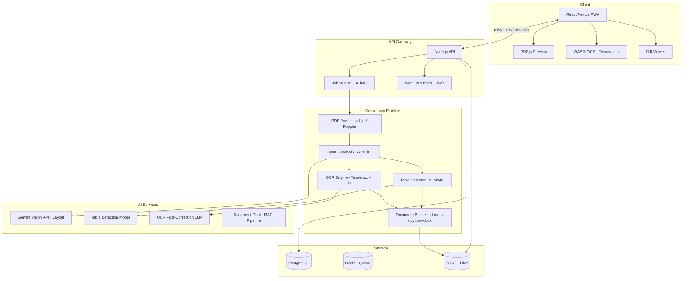

# 📝 PRD: ProPDF Reverse Converter — Advanced PDF to Word Platform

> **Version:** 1.0  
> **Date:** April 13, 2026  
> **Status:** Draft  
> **Author:** Product Team  
> **Related PRDs:** [Edit PDF](file:///home/headless/.gemini/antigravity/brain/acbe959b-f900-47fe-bc99-980172e8ace2/prd_edit_pdf.md) | [Word to PDF](file:///home/headless/.gemini/antigravity/brain/acbe959b-f900-47fe-bc99-980172e8ace2/prd_word_to_pdf.md)

---

## 1. 🎯 Vision & Overview

**ProPDF Reverse Converter** is a next-generation PDF to Word conversion platform that uses **AI-powered document intelligence**, **advanced OCR**, **smart layout reconstruction**, and **table-aware extraction** to produce perfectly editable Word documents — far beyond iLovePDF's basic "extract and hope" approach.

### Mission Statement
> *"Reverse-engineer any PDF back to a perfectly editable Word document — as if it was never converted."*

### The Core Problem — Why PDF to Word is HARD

PDF and Word are **fundamentally different** formats:

| | PDF | Word |
|---|---|---|
| Layout Model | **Fixed** — absolute coordinates (x, y) | **Reflowable** — dynamic paragraphs, margins |
| Text Storage | Individual characters/glyphs with positions | Paragraphs, styles, headings |
| Tables | Lines + text boxes (no "table" object) | Native table objects with rows/cells |
| Images | Embedded at exact position | Anchored to text or floating |
| Fonts | Embedded subsets | System fonts + embedded |

**Every converter today struggles with:**
1. ❌ Tables break into random text boxes
2. ❌ Multi-column layouts collapse into single column
3. ❌ Headers/footers merge into body text
4. ❌ Scanned PDFs produce garbage text (bad OCR)
5. ❌ Images lose position and resolution
6. ❌ Fonts change, spacing breaks, line breaks appear mid-sentence
7. ❌ Handwritten notes → completely ignored

**ProPDF solves ALL of these** with AI-powered document understanding.

---

## 2. 🔍 iLovePDF PDF to Word — Complete Function List

> [!NOTE]
> Below is **every function/option** that iLovePDF's PDF to Word tool currently provides.

### 2.1 iLovePDF PDF to Word — All Functions

#### A. Input / Upload
| # | iLovePDF Function | What It Does |
|---|-------------------|--------------|
| A1 | **Upload from Computer** | Browse or drag-and-drop file upload |
| A2 | **Import from Google Drive** | Select PDF from Google Drive |
| A3 | **Import from Dropbox** | Select PDF from Dropbox |
| A4 | **Multiple File Upload** | Upload multiple PDFs (Premium) |

#### B. Conversion Options
| # | iLovePDF Function | What It Does |
|---|-------------------|--------------|
| B1 | **One-Click Convert** | Single button to start conversion |
| B2 | **No OCR (Default)** | Convert digital/native PDF text to Word |
| B3 | **OCR Mode (Premium)** | Enable OCR for scanned PDFs — converts image-text to editable text |
| B4 | **OCR Language Selection** | Choose language for OCR accuracy |

#### C. Output / Download
| # | iLovePDF Function | What It Does |
|---|-------------------|--------------|
| C1 | **Download .docx** | Download converted Word file |
| C2 | **Save to Google Drive** | Export .docx to Google Drive |
| C3 | **Save to Dropbox** | Export .docx to Dropbox |
| C4 | **QR Code Download** | Scan QR to download on mobile |
| C5 | **Share Download Link** | Generate temporary download link |

#### D. Post-Conversion (Connected Tasks)
| # | iLovePDF Function | What It Does |
|---|-------------------|--------------|
| D1 | **Edit PDF** | Open original PDF in editor |
| D2 | **Compress PDF** | Compress original PDF |
| D3 | **Merge PDFs** | Merge with other PDFs |
| D4 | **Word to PDF** | Convert back to PDF |

#### E. Security
| # | iLovePDF Function | What It Does |
|---|-------------------|--------------|
| E1 | **HTTPS Upload** | Encrypted file transfer |
| E2 | **Auto-Delete (2 hours)** | Files removed from server automatically |

#### F. Platform
| # | iLovePDF Function | What It Does |
|---|-------------------|--------------|
| F1 | **Web Browser** | Works in any browser |
| F2 | **Desktop App** | Windows/Mac application |
| F3 | **Mobile App** | iOS/Android app |

---

**Total iLovePDF PDF to Word Functions: ~20 functions**

> [!WARNING]
> iLovePDF's PDF to Word is a **basic extractor** with:
> - ❌ No conversion settings (quality, layout mode, page range)
> - ❌ No preview of output before download
> - ❌ No table reconstruction intelligence
> - ❌ No multi-format output (only .docx)
> - ❌ No AI features
> - ❌ No API for developers
> - ❌ OCR is Premium-only and basic quality
> - ❌ No handwriting recognition
> - ❌ No selective extraction (extract only tables, only images, only text)

---

## 3. 🆚 Feature-by-Feature: iLovePDF vs ProPDF Reverse Converter

> [!IMPORTANT]
> Every iLovePDF function mapped with ProPDF equivalent + advancement.

### A. Input / Upload — iLovePDF ✅ → ProPDF ✅✅✅

| iLovePDF Function | ProPDF Equivalent | **ProPDF Advancement** |
|---|---|---|
| Upload from Computer | ✅ Smart Upload | + Drag entire folders, paste from clipboard, upload ZIP (auto-extract all PDFs) |
| Google Drive Import | ✅ Google Drive | + Browse folders, multi-select, auto-sync output back to Drive |
| Dropbox Import | ✅ Dropbox | + Full folder browsing, batch select |
| Multiple File Upload | ✅ Unlimited Batch (Free: 3, Pro: Unlimited) | + Folder upload, ZIP upload, URL import |
| ❌ *Not in iLovePDF* | ✅ **OneDrive / SharePoint** | **NEW**: Microsoft ecosystem integration |
| ❌ *Not in iLovePDF* | ✅ **Import via URL** | **NEW**: Paste URL to any hosted PDF → auto-fetch & convert |
| ❌ *Not in iLovePDF* | ✅ **Import via Email** | **NEW**: Email PDF to convert@propdf.com → get .docx reply |
| ❌ *Not in iLovePDF* | ✅ **Camera Scan** | **NEW**: Scan physical document with camera → PDF → Word (mobile) |
| ❌ *Not in iLovePDF* | ✅ **Clipboard Paste** | **NEW**: Screenshot/paste PDF content directly |

### B. Conversion Engine — iLovePDF ✅ → ProPDF ✅✅✅

| iLovePDF Function | ProPDF Equivalent | **ProPDF Advancement** |
|---|---|---|
| One-Click Convert | ✅ One-Click + Settings | + Quick convert OR open advanced settings panel |
| No OCR (digital PDF) | ✅ Smart Detection | + Auto-detects if PDF is digital or scanned → applies correct mode automatically |
| OCR Mode (Premium) | ✅ **AI OCR (Free tier included)** | + Free OCR for up to 5 pages/day, Premium unlimited. AI-powered, 99.5%+ accuracy |
| OCR Language Selection | ✅ 100+ Languages | + Auto-detect language, multi-language per page, RTL support (Arabic/Hebrew/Urdu) |
| ❌ *Not in iLovePDF* | ✅ **Conversion Settings Panel** | **NEW**: Full control over output (see Module 4) |
| ❌ *Not in iLovePDF* | ✅ **Layout Modes** | **NEW**: Exact Layout (match PDF look) vs Flow Layout (clean editable doc) vs Text Only |
| ❌ *Not in iLovePDF* | ✅ **AI Table Reconstruction** | **NEW**: AI detects table structures from lines/spacing and rebuilds as native Word tables |
| ❌ *Not in iLovePDF* | ✅ **AI Column Detection** | **NEW**: Detects multi-column layouts and reconstructs correctly (not collapsed into one) |
| ❌ *Not in iLovePDF* | ✅ **Header/Footer Separation** | **NEW**: AI separates headers/footers from body — places in Word header/footer area |
| ❌ *Not in iLovePDF* | ✅ **Font Matching** | **NEW**: Identifies original fonts and maps to closest available system/Google font |
| ❌ *Not in iLovePDF* | ✅ **Smart Line Break Removal** | **NEW**: Removes hard line breaks within paragraphs, keeps paragraph breaks |
| ❌ *Not in iLovePDF* | ✅ **Hyphenation Fix** | **NEW**: Joins hyphenated words at line breaks ("docu-ment" → "document") |
| ❌ *Not in iLovePDF* | ✅ **Heading Detection** | **NEW**: AI detects heading levels (H1-H6) from font size/weight → applies Word heading styles |
| ❌ *Not in iLovePDF* | ✅ **List Detection** | **NEW**: Detects bulleted/numbered lists → converts to native Word lists |
| ❌ *Not in iLovePDF* | ✅ **Footnote/Endnote Detection** | **NEW**: Detects footnotes/endnotes → places in Word footnote/endnote area |
| ❌ *Not in iLovePDF* | ✅ **TOC Reconstruction** | **NEW**: Rebuilds Table of Contents with clickable links from detected headings |
| ❌ *Not in iLovePDF* | ✅ **Watermark Removal** | **NEW**: AI detects and optionally removes watermarks during conversion |
| ❌ *Not in iLovePDF* | ✅ **Page Range** | **NEW**: Convert specific pages only (e.g., "1-5, 8, 12-15") |

### C. Output / Download — iLovePDF ✅ → ProPDF ✅✅✅

| iLovePDF Function | ProPDF Equivalent | **ProPDF Advancement** |
|---|---|---|
| Download .docx | ✅ Multi-Format Download | + .docx, .doc, .odt, .rtf, .txt, .html, .md (Markdown), .tex (LaTeX), .epub |
| Save to Google Drive | ✅ Google Drive | + Auto-save, choose folder, rename |
| Save to Dropbox | ✅ Dropbox | + Auto-save, choose folder |
| QR Code Download | ✅ QR + NFC | + QR code + NFC tap transfer |
| Share Download Link | ✅ Smart Share | + Password-protected, expiry, download limit |
| ❌ *Not in iLovePDF* | ✅ **Save to OneDrive** | **NEW**: Microsoft OneDrive export |
| ❌ *Not in iLovePDF* | ✅ **Email .docx** | **NEW**: Email converted file directly |
| ❌ *Not in iLovePDF* | ✅ **Webhook Delivery** | **NEW**: POST output to any API endpoint |
| ❌ *Not in iLovePDF* | ✅ **Bulk ZIP Download** | **NEW**: All batch outputs as ZIP |
| ❌ *Not in iLovePDF* | ✅ **Selective Export** | **NEW**: Export only tables / only images / only text separately |

### D. Post-Conversion — iLovePDF ✅ → ProPDF ✅✅✅

| iLovePDF Function | ProPDF Equivalent | **ProPDF Advancement** |
|---|---|---|
| Edit PDF | ✅ Open in ProPDF Editor | + Seamless redirect |
| Compress PDF | ✅ Compress | + Available as one-click |
| Merge PDFs | ✅ Merge | + Available inline |
| Word to PDF | ✅ Convert Back | + One-click reconvert to PDF with full settings |
| ❌ *Not in iLovePDF* | ✅ **Open in Google Docs** | **NEW**: Directly open output .docx in Google Docs |
| ❌ *Not in iLovePDF* | ✅ **Open in MS Word Online** | **NEW**: Launch in Word Online for immediate editing |
| ❌ *Not in iLovePDF* | ✅ **AI Proofread Output** | **NEW**: AI checks converted text for OCR errors, formatting issues |
| ❌ *Not in iLovePDF* | ✅ **Compare PDF vs Word** | **NEW**: Side-by-side view of original PDF vs output Word |

### E. Security — iLovePDF ✅ → ProPDF ✅✅✅

| iLovePDF Function | ProPDF Equivalent | **ProPDF Advancement** |
|---|---|---|
| HTTPS Upload | ✅ HTTPS + E2E Encryption | + TLS 1.3, end-to-end encryption |
| Auto-Delete 2hr | ✅ Configurable Retention | + Delete: immediately / 1hr / 24hr / 30 days |
| ❌ *Not in iLovePDF* | ✅ **Client-Side Conversion** | **NEW**: WASM — file NEVER leaves browser |
| ❌ *Not in iLovePDF* | ✅ **Unlock Protected PDF** | **NEW**: Enter password to convert protected PDFs |
| ❌ *Not in iLovePDF* | ✅ **AI PII Detection** | **NEW**: Warn about sensitive data in output |
| ❌ *Not in iLovePDF* | ✅ **Redact During Conversion** | **NEW**: Mark sections to redact — removed from Word output |
| ❌ *Not in iLovePDF* | ✅ **Audit Log** | **NEW**: Who converted what, when |
| ❌ *Not in iLovePDF* | ✅ **SOC 2 / GDPR / HIPAA** | **NEW**: Enterprise compliance |

### F. Platform — iLovePDF ✅ → ProPDF ✅✅✅

| iLovePDF Function | ProPDF Equivalent | **ProPDF Advancement** |
|---|---|---|
| Web Browser | ✅ PWA | + Installable, offline mode |
| Desktop App | ✅ Desktop | + Windows, Mac, Linux + right-click "Convert to Word" |
| Mobile App | ✅ Mobile | + iOS/Android + Share Sheet + Camera scan-to-Word |
| ❌ *Not in iLovePDF* | ✅ **REST API** | **NEW**: Full developer API |
| ❌ *Not in iLovePDF* | ✅ **CLI Tool** | **NEW**: `propdf to-word invoice.pdf` |
| ❌ *Not in iLovePDF* | ✅ **Browser Extension** | **NEW**: Right-click any PDF link → "Convert to Word" |
| ❌ *Not in iLovePDF* | ✅ **Slack/Teams Bot** | **NEW**: Upload PDF → bot returns .docx |

---

## 3.5 📊 Score Card

| Category | iLovePDF | ProPDF | **Advantage** |
|----------|----------|--------|-------------|
| Input / Upload | 4 | 4 + 9 new | **+325%** |
| Conversion Engine | 4 | 4 + 18 new | **+550%** |
| Output / Download | 5 | 5 + 10 new | **+300%** |
| Post-Conversion | 4 | 4 + 8 new | **+300%** |
| Security | 2 | 2 + 8 new | **+500%** |
| Platform | 3 | 3 + 7 new | **+333%** |
| **AI & OCR** | **0** *(basic OCR only)* | **15 new features** | **∞ (NEW)** |
| **Selective Extraction** | **0** | **8 new features** | **∞ (NEW)** |
| **Document Intelligence** | **0** | **10 new features** | **∞ (NEW)** |
| **Developer API** | **0** | **12 new features** | **∞ (NEW)** |
| **Batch Processing** | **0** | **8 new features** | **∞ (NEW)** |
| **Templates & Styling** | **0** | **6 new features** | **∞ (NEW)** |
| |||
| **TOTAL** | **~20 functions** | **~155+ functions** | **🔥 7.75x more features** |

---

## 4. 👥 Target Users & Personas

### Persona 1: Student (Riya, 20)
- Downloads PDF lecture notes, textbooks — needs to edit/annotate in Word
- Needs: Quick conversion, good OCR on scanned notes, free tier
- Pain: Tables break, math equations vanish, scanned PDFs produce garbage

### Persona 2: Lawyer (Advocate Sharma, 45)
- Receives contracts and legal filings as PDF — needs to edit, redline, compare
- Needs: Perfect text extraction, table fidelity, paragraph flow, confidentiality
- Pain: Line breaks mid-sentence, headers mixed into body, data leaks via cloud

### Persona 3: Data Analyst (Meera, 30)
- Extracts tables from PDF reports (financial, government data)
- Needs: Table extraction to Excel/Word, batch processing, API
- Pain: Tables become text soup, merged cells break, no API

### Persona 4: Publisher / Content Team (MediaHouse)
- Converts old PDF archives to editable format for republishing
- Needs: OCR on scanned docs, multi-language, preserve layout, batch
- Pain: Poor OCR quality, loses images, no batch mode

### Persona 5: Developer (Karan, 26)
- Building a SaaS that needs PDF-to-Word conversion
- Needs: REST API, webhooks, SDKs, reliable output
- Pain: No good API exists, Adobe is expensive, iLovePDF has no API

---

## 5. 🏗️ Feature Modules (Detailed)

---

### Module 1: 🧠 AI-Powered Document Intelligence Engine

> [!IMPORTANT]
> This is the **core differentiator**. Instead of dumb text extraction, ProPDF **understands** the document's structure using AI vision models.

| # | Feature | Description | Priority |
|---|---------|-------------|----------|
| 1.1 | **Document Layout Analysis** | AI identifies: body text, headings, headers, footers, sidebars, callouts, captions, page numbers | P0 |
| 1.2 | **Table Detection & Reconstruction** | AI detects tables (even without visible borders) → rebuilds as native Word tables with merged cells | P0 |
| 1.3 | **Column Detection** | Detects 2-3-4 column layouts → reconstructs in Word with proper column breaks | P0 |
| 1.4 | **Heading Hierarchy Detection** | AI infers H1-H6 from font size, weight, spacing → applies Word heading styles | P0 |
| 1.5 | **List Detection** | Detects bulleted/numbered/nested lists → native Word list formatting | P0 |
| 1.6 | **Header/Footer Separation** | Separates repeating headers/footers → places in Word header/footer regions | P0 |
| 1.7 | **Footnote/Endnote Detection** | Detects footnotes → places in Word footnote area with superscript references | P1 |
| 1.8 | **Caption Detection** | Detects image/table captions → associates with elements | P1 |
| 1.9 | **Sidebar/Callout Detection** | Detects colored boxes, callouts, sidebars → converts to Word text boxes | P2 |
| 1.10 | **TOC Reconstruction** | Rebuilds clickable Table of Contents from detected headings | P1 |
| 1.11 | **Reading Order Intelligence** | Determines correct reading order in complex layouts (vs. raw PDF coordinate order) | P0 |
| 1.12 | **Math Equation Recognition** | Detects math formulas → converts to Word equation objects (OMML) | P2 |

---

### Module 2: 🔍 Advanced OCR Engine

| # | Feature | Description | Priority |
|---|---------|-------------|----------|
| 2.1 | **AI OCR** | Deep learning OCR with 99.5%+ accuracy on clean scans | P0 |
| 2.2 | **100+ Languages** | Support for Latin, Cyrillic, CJK, Arabic, Hebrew, Devanagari, Thai, etc. | P0 |
| 2.3 | **Auto Language Detection** | Automatically detect document language (even mixed-language docs) | P0 |
| 2.4 | **Multi-Language Per Page** | Handle pages with text in multiple languages simultaneously | P1 |
| 2.5 | **RTL Support** | Right-to-left languages: Arabic, Hebrew, Urdu, Persian | P1 |
| 2.6 | **Handwriting Recognition** | Convert handwritten text (pen/pencil) to typed text | P1 |
| 2.7 | **Low-Quality Scan Enhancement** | AI pre-processes: deskew, denoise, contrast boost, binarize before OCR | P0 |
| 2.8 | **Confidence Scores** | Show per-word confidence score — highlight low-confidence words for review | P1 |
| 2.9 | **OCR Correction UI** | Interactive UI to fix OCR errors before finalizing output | P1 |
| 2.10 | **Mixed Content Detection** | Handle PDFs with both digital text AND scanned pages (hybrid) | P0 |
| 2.11 | **Barcode/QR Recognition** | Detect and decode barcodes/QR codes in scanned PDFs | P2 |
| 2.12 | **Stamp/Seal Detection** | Detect stamps/seals → preserve as image in Word output | P2 |

---

### Module 3: 📊 Intelligent Table Extraction

> [!IMPORTANT]
> Table extraction is the **#1 pain point** in PDF to Word conversion. ProPDF makes it perfect.

| # | Feature | Description | Priority |
|---|---------|-------------|----------|
| 3.1 | **Bordered Table Detection** | Detect tables with visible borders/lines | P0 |
| 3.2 | **Borderless Table Detection** | AI detects tables from text alignment even WITHOUT visible borders | P0 |
| 3.3 | **Merged Cell Reconstruction** | Correctly handle merged cells (colspan/rowspan) | P0 |
| 3.4 | **Nested Table Support** | Tables inside tables — reconstructed correctly | P1 |
| 3.5 | **Table Header Detection** | Identify header rows → apply Word table header style | P0 |
| 3.6 | **Multi-Page Table** | Tables spanning multiple pages → merged into single Word table | P1 |
| 3.7 | **Table Styling** | Preserve cell colors, borders, fonts, alignment in Word | P0 |
| 3.8 | **Export Tables to Excel** | Option to export ONLY tables as .xlsx instead of Word | P0 |
| 3.9 | **Export Tables to CSV** | Export tables as CSV for data processing | P1 |
| 3.10 | **Table Preview** | Preview all detected tables before conversion — click to include/exclude | P1 |

---

### Module 4: ⚙️ Conversion Settings Panel

> iLovePDF has ZERO conversion settings. ProPDF gives full control.

| # | Feature | Description | Priority |
|---|---------|-------------|----------|
| 4.1 | **Layout Mode** | **Exact** (match PDF layout with text boxes) vs **Flow** (clean editable paragraphs) vs **Text Only** (plain text) | P0 |
| 4.2 | **OCR Toggle** | Force OCR On / Off / Auto-detect | P0 |
| 4.3 | **OCR Language** | Select one or more OCR languages | P0 |
| 4.4 | **Page Range** | Convert all pages / specific pages ("1-5, 8, 12-15") | P0 |
| 4.5 | **Output Format** | .docx, .doc, .odt, .rtf, .txt, .html, .md, .tex, .epub | P0 |
| 4.6 | **Image Handling** | Extract at full resolution / Compress / Exclude images entirely | P0 |
| 4.7 | **Table Handling** | Reconstruct as Word tables / Convert to images / Skip tables | P0 |
| 4.8 | **Header/Footer** | Include in body / Move to Word header-footer / Remove | P1 |
| 4.9 | **Line Break Mode** | Preserve original / Smart-remove (join paragraphs) / Custom | P0 |
| 4.10 | **Heading Detection** | Auto-detect headings / Manual heading map / Disable | P1 |
| 4.11 | **Watermark Handling** | Preserve / Remove / Move to Word watermark | P1 |
| 4.12 | **Font Mapping** | Auto-match / Custom map (PDF font → Word font) / Embed | P1 |
| 4.13 | **Page Size** | Match PDF / Force A4 / Force Letter / Custom | P1 |
| 4.14 | **Encoding** | UTF-8 (default) / ASCII / Custom | P2 |
| 4.15 | **Presets** | Save settings as named presets ("Legal Docs", "Reports", "Scanned Books") | P1 |

---

### Module 5: 🖼️ Image & Media Extraction

| # | Feature | Description | Priority |
|---|---------|-------------|----------|
| 5.1 | **Preserve All Images** | Extract and place images at original position in Word | P0 |
| 5.2 | **Full Resolution** | Extract at original resolution (no compression) | P0 |
| 5.3 | **Export Images Only** | Extract ALL images as separate files (PNG/JPG/SVG) + ZIP | P0 |
| 5.4 | **Image Format** | Output as: PNG, JPG, WebP, SVG, TIFF | P1 |
| 5.5 | **Vector Preservation** | Vector graphics (logos, charts) → preserved as SVG/EMF in Word | P1 |
| 5.6 | **Chart Reconstruction** | AI detects charts → reconstructs as editable Word/Excel charts | P2 |
| 5.7 | **AI Image Enhancement** | Enhance low-res extracted images (upscale, denoise) | P2 |
| 5.8 | **Background Removal** | Option to extract images without background | P2 |

---

### Module 6: 🤖 AI Features

| # | Feature | Description | Priority |
|---|---------|-------------|----------|
| 6.1 | **AI Smart Convert** | AI chooses optimal settings for each document automatically | P0 |
| 6.2 | **AI Error Detection** | After conversion, AI scans output for OCR errors, layout issues — highlights problems | P0 |
| 6.3 | **AI Auto-Correct OCR** | AI fixes common OCR errors (l/1, O/0, rn/m) using language context | P1 |
| 6.4 | **AI Translate** | Translate entire document during conversion (50+ languages) | P1 |
| 6.5 | **AI Summarize** | Generate summary of PDF content and include as first page | P2 |
| 6.6 | **AI Document Chat** | Chat with your PDF — ask questions, extract specific info | P1 |
| 6.7 | **AI PII Detection** | Detect sensitive data → warn/redact before outputting Word | P1 |
| 6.8 | **AI Style Transfer** | Apply a Word template style to the converted output (match brand guidelines) | P2 |
| 6.9 | **AI Content Extraction** | Ask AI to extract specific info: "Extract all names and dates", "Find all amounts" | P1 |
| 6.10 | **AI Fill-in-the-blanks** | AI detects form-like PDFs → extracts field labels + values as structured data | P2 |

---

### Module 7: 📦 Batch Processing

| # | Feature | Description | Priority |
|---|---------|-------------|----------|
| 7.1 | **Multi-File Upload** | Up to 100 files at once | P0 |
| 7.2 | **Folder Upload** | Upload entire folder (recursive) | P1 |
| 7.3 | **ZIP Upload** | Upload ZIP → auto-extract all PDFs | P1 |
| 7.4 | **Parallel Processing** | Convert multiple files simultaneously | P0 |
| 7.5 | **Per-File Status** | Individual progress + success/error for each | P0 |
| 7.6 | **Batch Settings** | Apply same settings to all files | P0 |
| 7.7 | **ZIP Download** | Download all outputs as ZIP | P0 |
| 7.8 | **Merge Outputs** | Merge all Word outputs into one .docx | P1 |

---

### Module 8: 👀 Live Preview & Quality Check

| # | Feature | Description | Priority |
|---|---------|-------------|----------|
| 8.1 | **Output Preview** | View converted Word document in-browser before downloading | P0 |
| 8.2 | **Side-by-Side Comparison** | PDF (left) vs Word (right) — synchronized scrolling | P0 |
| 8.3 | **Diff Highlight** | Auto-highlight differences between PDF and Word output | P1 |
| 8.4 | **OCR Confidence View** | Color-coded text showing OCR confidence (green=high, red=low) | P1 |
| 8.5 | **Table Preview** | Preview all extracted tables — verify structure before download | P1 |
| 8.6 | **Font Report** | Which fonts were matched, substituted, or missing | P1 |
| 8.7 | **Quality Score** | Overall conversion quality score (0-100%) with breakdown | P1 |
| 8.8 | **Re-Convert** | Adjust settings and re-convert without re-uploading | P0 |

---

### Module 9: 📤 Selective Extraction

> [!TIP]
> Sometimes you don't need the full document — just the tables, images, or specific text.

| # | Feature | Description | Priority |
|---|---------|-------------|----------|
| 9.1 | **Extract Text Only** | Pure text extraction (no formatting) → .txt, .md | P0 |
| 9.2 | **Extract Tables Only** | All tables → .xlsx, .csv, or Word tables-only doc | P0 |
| 9.3 | **Extract Images Only** | All images → ZIP of PNG/JPG/SVG files | P0 |
| 9.4 | **Extract Metadata** | Author, title, creation date, page count, font list → JSON | P1 |
| 9.5 | **Extract Links** | All hyperlinks → list with page numbers | P1 |
| 9.6 | **Extract Annotations** | All comments, highlights, notes → structured list | P1 |
| 9.7 | **Extract Form Data** | All form field values → JSON/CSV | P0 |
| 9.8 | **AI-Powered Data Extraction** | "Extract all invoice amounts" → structured JSON/CSV | P1 |

---

### Module 10: 🔌 Developer API

| # | Feature | Description | Priority |
|---|---------|-------------|----------|
| 10.1 | **REST API** | `POST /api/v1/pdf-to-word` — upload PDF, get .docx | P0 |
| 10.2 | **Node.js SDK** | Native JavaScript/TypeScript SDK | P0 |
| 10.3 | **Python SDK** | Native Python package | P0 |
| 10.4 | **PHP / Java / .NET SDKs** | Enterprise language support | P1 |
| 10.5 | **Webhooks** | POST notification when async conversion completes | P0 |
| 10.6 | **Batch API** | Convert multiple files in one API call | P0 |
| 10.7 | **Async Jobs** | Submit → poll → download pattern for large files | P0 |
| 10.8 | **Conversion Options API** | Full settings via API params (layout mode, OCR, pages, format) | P0 |
| 10.9 | **Table Extraction API** | Extract only tables as JSON/CSV | P0 |
| 10.10 | **Text Extraction API** | Extract only text as JSON (with page numbers, positions) | P0 |
| 10.11 | **Image Extraction API** | Extract images as URLs/base64 | P1 |
| 10.12 | **Swagger/OpenAPI Docs** | Interactive API documentation | P0 |

---

### Module 11: 🔄 Workflow Automation

| # | Feature | Description | Priority |
|---|---------|-------------|----------|
| 11.1 | **Watch Folder** | Monitor cloud folder → auto-convert new PDFs to Word | P1 |
| 11.2 | **Zapier Integration** | Trigger: "New PDF in Drive" → Action: "Convert to Word" | P1 |
| 11.3 | **Make (Integromat)** | Visual workflow builder | P2 |
| 11.4 | **Email-to-Word** | Email PDF → get .docx reply | P1 |
| 11.5 | **Slack Bot** | Upload PDF → bot returns .docx | P1 |
| 11.6 | **MS Teams Bot** | Same for Teams | P2 |
| 11.7 | **Scheduled Batch** | Schedule recurring batch conversion | P2 |

---

### Module 12: 📝 Output Styling & Templates

| # | Feature | Description | Priority |
|---|---------|-------------|----------|
| 12.1 | **Apply Word Template** | Apply .dotx template to output (fonts, styles, header/footer) | P1 |
| 12.2 | **Brand Kit** | Set default fonts, colors, logo for all outputs | P2 |
| 12.3 | **Cover Page** | Auto-add cover page to output | P2 |
| 12.4 | **Custom Styles Map** | Map detected elements to custom Word styles | P2 |
| 12.5 | **Clean-Up Mode** | Auto-remove: blank pages, repeated headers, page numbers in body | P1 |
| 12.6 | **Re-Paginate** | Adjust output to A4/Letter with proper margins | P1 |

---

### Module 13: ♿ Accessibility

| # | Feature | Description | Priority |
|---|---------|-------------|----------|
| 13.1 | **Alt Text Transfer** | Transfer image alt text from PDF tags to Word | P1 |
| 13.2 | **Heading Structure** | Ensure proper H1-H6 heading hierarchy in output | P1 |
| 13.3 | **Reading Order** | Set logical reading order in output document | P1 |
| 13.4 | **Language Tag** | Set document language metadata | P0 |
| 13.5 | **Screen Reader Optimized** | Output optimized for screen reader compatibility | P2 |

---

### Module 14: 🔐 Security & Compliance

| # | Feature | Description | Priority |
|---|---------|-------------|----------|
| 14.1 | **Client-Side WASM** | Convert in-browser — zero server upload | P0 |
| 14.2 | **E2E Encryption** | Encrypted upload/download | P0 |
| 14.3 | **Configurable Retention** | User controls file deletion timing | P0 |
| 14.4 | **Password-Protected PDFs** | Enter password to unlock and convert | P0 |
| 14.5 | **PII Auto-Redact** | AI detects and removes PII from output | P1 |
| 14.6 | **Audit Log** | Complete conversion audit trail | P1 |
| 14.7 | **SOC 2 / GDPR / HIPAA** | Enterprise compliance | P1 |
| 14.8 | **Data Residency** | Choose processing region (US/EU/Asia) | P2 |

---

### Module 15: 📊 Analytics & History

| # | Feature | Description | Priority |
|---|---------|-------------|----------|
| 15.1 | **Conversion History** | All past conversions with date, file, settings, quality score | P0 |
| 15.2 | **Re-Download** | Re-download any previous conversion output | P0 |
| 15.3 | **Re-Convert** | Re-run conversion with different settings | P0 |
| 15.4 | **Usage Stats** | Monthly conversions, pages processed, API calls | P0 |
| 15.5 | **Error Dashboard** | Common errors and resolution suggestions | P2 |

---

## 6. 🎨 UI/UX Design

### Main Conversion Interface
```
┌──────────────────────────────────────────────────────────────────┐
│  ProPDF  ▸ PDF to Word                       [Dark Mode]  [Pro] │
├──────────────────────────────────────────────────────────────────┤
│                                                                  │
│  ┌──────────────────────────────────────────────────────────┐   │
│  │                                                          │   │
│  │     📄 Drop PDF files here or click to browse           │   │
│  │                                                          │   │
│  │  [Google Drive]  [Dropbox]  [OneDrive]  [URL]  [Scan]   │   │
│  │                                                          │   │
│  └──────────────────────────────────────────────────────────┘   │
│                                                                  │
│  ┌─ Conversion Mode ─────────────────────────────────────────┐  │
│  │ [● Flow Layout]  [○ Exact Layout]  [○ Text Only]         │  │
│  ├───────────────────────────────────────────────────────────┤  │
│  │ Output: [.docx ▼]    Pages: [All ▼]    OCR: [Auto ▼]    │  │
│  │ Tables: [Reconstruct ▼]  Images: [Full Res ▼]           │  │
│  │ [+ Advanced Settings]               [📋 Load Preset ▼]  │  │
│  └───────────────────────────────────────────────────────────┘  │
│                                                                  │
│  ┌─ AI Enhancements ────────────────────────────────────────┐   │
│  │ □ Smart Line Break Fix    □ Heading Detection             │  │
│  │ □ Watermark Removal       □ AI Error Correction           │  │
│  │ □ Translate to [English▼]  □ PII Detection                │  │
│  └───────────────────────────────────────────────────────────┘  │
│                                                                  │
│   [ 🔄 Convert to Word ]    [ 👁 Preview Before Convert ]      │
│                                                                  │
├──────────────────────────────────────────────────────────────────┤
│  Results:                                                        │
│  ✅ Report_Q4.pdf    → 98% quality  [Preview] [↓ .docx] [📊]  │
│  ⏳ Invoice_032.pdf  → Converting... 73%  (OCR: page 4/6)      │
│  ⚠️ Scan_old.pdf    → 82% quality — 12 low-confidence words    │
│  │                     [Review OCR Errors] [↓ Download Anyway]  │
├──────────────────────────────────────────────────────────────────┤
│  [↓ Download All ZIP]  [📊 Extract Tables Only]  [🗑 Clear]   │
└──────────────────────────────────────────────────────────────────┘
```

### Preview & Quality Check View
```
┌────────────────────────────────────┬─────────────────────────────┐
│         ORIGINAL PDF               │       CONVERTED WORD        │
│                                    │                             │
│  ┌──────────────────────────┐     │  ┌───────────────────────┐  │
│  │  Company Report          │     │  │  Company Report        │  │
│  │  ══════════════          │     │  │  (Heading 1 style)     │  │
│  │                          │     │  │                        │  │
│  │  Sales | Q1  | Q2  | Q3  │     │  │  ┌───┬────┬────┬───┐  │  │
│  │  ─────+─────+─────+──── │     │  │  │   │ Q1 │ Q2 │Q3 │  │  │
│  │  East  | 120 | 150 | 180 │     │  │  ├───┼────┼────┼───┤  │  │
│  │  West  | 90  | 110 | 130 │     │  │  │Est│120 │150 │180│  │  │
│  │                          │     │  │  │Wst│ 90 │110 │130│  │  │
│  └──────────────────────────┘     │  └───────────────────────┘  │
│                                    │                             │
│  Quality: ████████████░░ 92%       │  Font: ✅ Matched          │
│  Tables: ✅ 3 detected             │  Tables: ✅ 3 reconstructed│
│  Images: ✅ 7 extracted            │  Headings: ✅ H1-H3 applied│
└────────────────────────────────────┴─────────────────────────────┘
  [✏️ Fix OCR Errors (2)]  [Re-Convert with Changes]  [↓ Download]
```

---

## 7. 🔧 Technical Architecture



### Key Technical Decisions

| Area | Technology | Rationale |
|------|-----------|-----------|
| PDF Parsing | **pdf.js + Poppler** | Extract text, positions, images, fonts from PDF structure |
| Layout Analysis | **Gemini Vision API** | AI vision model understands document layout from rendered pages |
| Table Detection | **Custom YOLO/DETR model** | Fine-tuned on document tables (borderless + bordered) |
| OCR Engine | **Tesseract 5 + AI post-correction** | Open-source OCR + LLM-based error correction |
| Handwriting OCR | **Google Vision API** | Best-in-class handwriting recognition |
| Word Builder | **docx.js (JS) / python-docx (Python)** | Programmatic .docx generation with styles, tables, images |
| Client OCR | **Tesseract.js (WASM)** | In-browser OCR for privacy mode |
| Job Queue | **BullMQ (Redis)** | Reliable async job processing |
| File Upload | **tus.io** | Resumable uploads |

---

## 8. 💰 Monetization Strategy

### Pricing Tiers

| Plan | Price | Limits |
|------|-------|--------|
| **Free** | ₹0 / $0 | 3 conversions/day, 10MB limit, basic OCR (5 pages), no batch |
| **Pro** | ₹399/mo / $5/mo | Unlimited conversions, 200MB files, AI OCR unlimited, batch (20), all output formats, presets |
| **Business** | ₹1,299/mo / $15/mo | Pro + API (5000 calls), team features, selective extraction, compliance tools |
| **Enterprise** | Custom | Unlimited API, SSO, HIPAA, on-premise, SLA, dedicated support |

### Revenue Streams
- **API Pay-as-you-go** — $0.02 per page (OCR), $0.01 per page (digital)
- **AI Features Credits** — Translation, summarization, chat beyond plan limits
- **White-Label** — License conversion engine for SaaS embedding
- **On-Premise** — Docker deployment for enterprises ($8000/yr)

---

## 9. 🗺️ Phased Roadmap

### Phase 1 — MVP (Month 1-3) 🏁
- [ ] PDF text extraction (digital PDFs) → .docx
- [ ] Basic OCR (Tesseract) for scanned PDFs
- [ ] AI table detection & reconstruction
- [ ] AI heading/list detection
- [ ] 3 layout modes (Flow, Exact, Text Only)
- [ ] Conversion settings panel
- [ ] Preview before download
- [ ] Multi-format output (.docx, .doc, .txt)
- [ ] Side-by-side comparison view
- [ ] User auth + file storage
- [ ] Dark mode responsive UI

### Phase 2 — AI & Quality (Month 4-6) 🤖
- [ ] AI layout analysis (full pipeline)
- [ ] AI OCR error correction
- [ ] Header/footer separation
- [ ] Footnote/endnote detection
- [ ] Smart line break removal
- [ ] Font matching engine
- [ ] OCR confidence view + correction UI
- [ ] Handwriting recognition
- [ ] Quality score system
- [ ] Multi-language OCR (100+ languages)

### Phase 3 — API & Batch (Month 7-9) 🔌
- [ ] REST API v1 + API key management
- [ ] Node.js + Python SDKs
- [ ] Webhooks for async jobs
- [ ] Table extraction API (JSON/CSV)
- [ ] Batch processing (100 files)
- [ ] Selective extraction (tables/images/text only)
- [ ] Image extraction pipeline
- [ ] ZIP upload + download
- [ ] Conversion presets system

### Phase 4 — Enterprise & Automation (Month 10-12) 🏢
- [ ] Watch folder automation
- [ ] Zapier + Slack + Teams integrations
- [ ] Email-to-Word pipeline
- [ ] CLI tool + browser extension
- [ ] Word template application
- [ ] AI document chat
- [ ] AI translation
- [ ] PII detection + redaction
- [ ] SOC 2 / GDPR / HIPAA compliance
- [ ] WASM client-side conversion
- [ ] On-premise Docker deployment
- [ ] Mobile apps with camera scan

---

## 10. ⚠️ Risks & Mitigations

| Risk | Impact | Mitigation |
|------|--------|------------|
| Complex PDF layouts break | High | AI vision model + extensive test suite (10,000+ PDFs from all industries) |
| OCR accuracy on poor scans | High | Multi-stage AI enhancement: deskew → denoise → contrast → OCR → LLM correction |
| Table detection false positives | Medium | Confidence thresholds + user preview/correction before download |
| Handwriting recognition errors | Medium | Show confidence scores, allow manual correction |
| Large file performance | High | Streaming page-by-page conversion, worker auto-scaling |
| Font licensing issues | Low | Use open-source font alternatives, Google Fonts library |
| API abuse | Medium | Rate limiting, CAPTCHA, IP throttling |
| AI costs | Medium | Cache common patterns, use efficient models, tiered pricing |

---

## 11. 📊 Final Summary — Why ProPDF > iLovePDF (PDF to Word)

| Dimension | iLovePDF | ProPDF Reverse Converter |
|-----------|----------|--------------------------|
| Conversion Intelligence | Dumb text extraction | AI document understanding |
| Table Handling | ❌ Tables break | ✅ AI table reconstruction (borderless too) |
| OCR Quality | Basic (Premium only) | ✅ AI OCR 99.5%+ (free tier included) |
| Handwriting | ❌ None | ✅ AI handwriting recognition |
| Settings | ❌ Zero options | ✅ 15+ conversion settings |
| Layout Modes | ❌ One mode | ✅ Flow / Exact / Text Only |
| Preview | ❌ None | ✅ Side-by-side + quality score |
| Output Formats | .docx only | ✅ 9 formats (.docx, .odt, .md, .html, .epub, etc.) |
| Selective Extraction | ❌ None | ✅ Tables only / Images only / Text only |
| Developer API | ❌ None | ✅ Full REST API + SDKs |
| Batch | Basic Premium | ✅ 100 files parallel |
| AI Features | ❌ None | ✅ 10 AI features |
| Security | Basic | ✅ Client-side WASM, SOC 2, HIPAA |
| Total Functions | **~20** | **~155+** |
| | | **🔥 7.75x more features** |

---

> [!TIP]
> **Next Steps:** Review this PRD and provide feedback. Key decisions needed:
> 1. Should free tier include basic OCR? (iLovePDF charges for it)
> 2. AI Table detection: use open-source model or build custom?
> 3. Priority: Consumer web UI first or Developer API first?
> 4. Handwriting recognition: Phase 2 or Phase 4?
