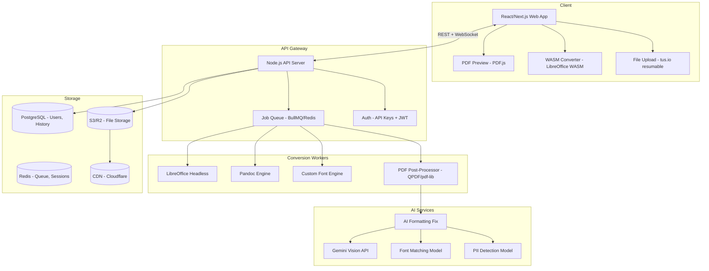

# 📝 PRD: ProPDF Word Converter — Advanced Word to PDF Platform

> **Version:** 1.0  
> **Date:** April 13, 2026  
> **Status:** Draft  
> **Author:** Product Team  
> **Related PRD:** [Edit PDF PRD](file:///home/headless/.gemini/antigravity/brain/acbe959b-f900-47fe-bc99-980172e8ace2/prd_edit_pdf.md)

---

## 1. 🎯 Vision & Overview

**ProPDF Word Converter** is a next-generation document conversion platform that transforms Word documents into pixel-perfect PDFs with **zero formatting loss**, **AI-powered enhancements**, **batch processing at scale**, and a **developer-friendly API**. It goes far beyond iLovePDF's basic "upload → convert → download" workflow.

### Mission Statement
> *"Convert any Word document to a flawless PDF — instantly, intelligently, and at any scale."*

### The Core Problem
Every Word-to-PDF converter today suffers from the same issues:
1. **Font substitution** — Custom fonts get replaced, breaking layout
2. **Layout shifts** — Tables, images, headers/footers misalign
3. **Lost interactivity** — Hyperlinks, bookmarks, TOC links disappear
4. **No intelligence** — Just a dumb format converter, no optimization
5. **No workflow** — Convert one file at a time, no automation

**ProPDF solves ALL of these** with a proprietary rendering engine + AI.

---

## 2. 🔍 iLovePDF Word to PDF — Complete Function List

> [!NOTE]
> Below is **every function/option** that iLovePDF's Word to PDF tool currently provides. Our PRD must cover ALL of these + go significantly beyond.

### 2.1 iLovePDF Word to PDF — All Functions

#### A. Input / Upload
| # | iLovePDF Function | What It Does |
|---|-------------------|--------------|
| A1 | **Upload from Computer** | Browse or drag-and-drop file upload |
| A2 | **Import from Google Drive** | Select file from Google Drive |
| A3 | **Import from Dropbox** | Select file from Dropbox |
| A4 | **Supported Formats** | .doc, .docx, .odt, .ott, .stw, .sdw, .sxw |
| A5 | **Multiple File Upload** | Upload multiple files at once (Premium) |

#### B. Conversion Process
| # | iLovePDF Function | What It Does |
|---|-------------------|--------------|
| B1 | **One-Click Convert** | Single button to start conversion |
| B2 | **Format Preservation** | Attempts to preserve text, images, layout |
| B3 | **Server-Side Processing** | Conversion happens on iLovePDF servers |
| B4 | **Progress Indicator** | Shows conversion progress |

#### C. Output / Download
| # | iLovePDF Function | What It Does |
|---|-------------------|--------------|
| C1 | **Download PDF** | Download converted PDF to computer |
| C2 | **Save to Google Drive** | Export PDF to Google Drive |
| C3 | **Save to Dropbox** | Export PDF to Dropbox |
| C4 | **QR Code Download** | Scan QR to download on mobile |
| C5 | **Share Download Link** | Generate temporary download link |

#### D. Post-Conversion Tools (Connected Tasks)
| # | iLovePDF Function | What It Does |
|---|-------------------|--------------|
| D1 | **Merge PDFs** | Combine with other PDFs after conversion |
| D2 | **Compress PDF** | Reduce file size after conversion |
| D3 | **Edit PDF** | Open in iLovePDF editor after conversion |
| D4 | **Sign PDF** | Add signature after conversion |

#### E. Security & Privacy
| # | iLovePDF Function | What It Does |
|---|-------------------|--------------|
| E1 | **HTTPS Upload** | Encrypted file transfer |
| E2 | **Auto-Delete (2 hours)** | Files removed from server after 2 hours |

#### F. Platform Access
| # | iLovePDF Function | What It Does |
|---|-------------------|--------------|
| F1 | **Web Browser** | Works in any browser |
| F2 | **Desktop App** | Windows/Mac application |
| F3 | **Mobile App** | iOS/Android app |

---

**Total iLovePDF Word to PDF Functions: ~18 functions**

> [!WARNING]
> iLovePDF's Word to PDF is essentially a **basic file converter** with no conversion settings, no quality controls, no preview, no AI, no API, and no batch automation. It's a black box — upload, pray the formatting holds, download.

---

## 3. 🆚 Feature-by-Feature: iLovePDF vs ProPDF Word Converter

> [!IMPORTANT]
> Every single iLovePDF function is mapped below with its ProPDF equivalent + advancement.

### A. Input / Upload — iLovePDF ✅ → ProPDF ✅✅✅

| iLovePDF Function | ProPDF Equivalent | **ProPDF Advancement** |
|---|---|---|
| Upload from Computer | ✅ Smart Upload | + Drag-and-drop multiple files, paste from clipboard, folder upload (recursive) |
| Google Drive Import | ✅ Google Drive | + Browse folders, select multiple files, auto-sync converted PDF back |
| Dropbox Import | ✅ Dropbox | + Full folder browsing, batch select |
| Supported Formats (.doc/.docx/.odt) | ✅ 15+ Formats | + .doc, .docx, .odt, .ott, .rtf, .txt, .html, .epub, .md (Markdown), .tex (LaTeX), .pages (Apple), .wps, .wpd, .xml, .mht |
| Multiple File Upload (Premium) | ✅ Unlimited Batch Upload (Free: 5, Pro: Unlimited) | + Drag entire folders, ZIP upload (auto-extract), URL import (fetch from web) |
| ❌ *Not in iLovePDF* | ✅ **Import from OneDrive** | **NEW**: Microsoft OneDrive/SharePoint integration |
| ❌ *Not in iLovePDF* | ✅ **Import from Box** | **NEW**: Box.com cloud storage integration |
| ❌ *Not in iLovePDF* | ✅ **Import via Email** | **NEW**: Email a .docx to convert@propdf.com → get PDF reply |
| ❌ *Not in iLovePDF* | ✅ **Import via URL** | **NEW**: Paste a URL to a hosted .docx → auto-download & convert |
| ❌ *Not in iLovePDF* | ✅ **Google Docs Direct** | **NEW**: Convert Google Docs directly (no download needed) |
| ❌ *Not in iLovePDF* | ✅ **Notion Page Import** | **NEW**: Import and convert Notion pages to PDF |

### B. Conversion Engine — iLovePDF ✅ → ProPDF ✅✅✅

| iLovePDF Function | ProPDF Equivalent | **ProPDF Advancement** |
|---|---|---|
| One-Click Convert | ✅ One-Click + Settings | + Quick convert OR open settings panel for full control |
| Format Preservation (basic) | ✅ **Pixel-Perfect Fidelity Engine** | + Proprietary rendering that matches MS Word output exactly — fonts, tables, headers, footers, margins, columns, TOC |
| Server-Side Processing | ✅ Hybrid Processing | + Server-side (default) OR client-side WASM (privacy mode — file never leaves browser) |
| Progress Indicator | ✅ Detailed Progress | + Per-file progress, estimated time, page count, error details in real-time |
| ❌ *Not in iLovePDF* | ✅ **Live Preview** | **NEW**: See PDF output preview BEFORE downloading — page-by-page |
| ❌ *Not in iLovePDF* | ✅ **Side-by-Side Comparison** | **NEW**: View Word (left) vs PDF (right) to verify fidelity |
| ❌ *Not in iLovePDF* | ✅ **Conversion Settings Panel** | **NEW**: Full control over output (see Module 5 below) |
| ❌ *Not in iLovePDF* | ✅ **Font Embedding** | **NEW**: Auto-embed all custom fonts into PDF to prevent substitution |
| ❌ *Not in iLovePDF* | ✅ **Font Substitution Map** | **NEW**: If font missing, user chooses replacement (not random auto-pick) |
| ❌ *Not in iLovePDF* | ✅ **Hyperlink Preservation** | **NEW**: All hyperlinks, TOC links, cross-references preserved as clickable PDF links |
| ❌ *Not in iLovePDF* | ✅ **Bookmark Auto-Generation** | **NEW**: Auto-create PDF bookmarks from Word headings (H1-H6) |
| ❌ *Not in iLovePDF* | ✅ **Smart Error Detection** | **NEW**: AI detects conversion issues (broken images, missing fonts, overflow text) and warns before download |

### C. Output / Download — iLovePDF ✅ → ProPDF ✅✅✅

| iLovePDF Function | ProPDF Equivalent | **ProPDF Advancement** |
|---|---|---|
| Download PDF | ✅ Multi-Format Download | + PDF, PDF/A (archival), PDF/X (print-ready), PDF/E (engineering), PDF/UA (accessible) |
| Save to Google Drive | ✅ Google Drive | + Auto-save, choose folder, rename file |
| Save to Dropbox | ✅ Dropbox | + Auto-save, choose folder |
| QR Code Download | ✅ QR + NFC | + QR code + NFC tap transfer (mobile) |
| Share Download Link | ✅ Smart Share Link | + Password-protected link, expiry date, download limit, view-only option |
| ❌ *Not in iLovePDF* | ✅ **Save to OneDrive** | **NEW**: Microsoft OneDrive export |
| ❌ *Not in iLovePDF* | ✅ **Email PDF** | **NEW**: Send converted PDF directly via email |
| ❌ *Not in iLovePDF* | ✅ **Webhook Delivery** | **NEW**: Auto-POST converted PDF to any URL/API endpoint |
| ❌ *Not in iLovePDF* | ✅ **Auto-Upload to S3/R2** | **NEW**: Direct upload to AWS S3, Cloudflare R2, GCS bucket |
| ❌ *Not in iLovePDF* | ✅ **Bulk ZIP Download** | **NEW**: Download all batch-converted PDFs as a single ZIP |
| ❌ *Not in iLovePDF* | ✅ **Merge After Convert** | **NEW**: Merge all converted PDFs into ONE file (with page order control) |

### D. Post-Conversion — iLovePDF ✅ → ProPDF ✅✅✅

| iLovePDF Function | ProPDF Equivalent | **ProPDF Advancement** |
|---|---|---|
| Merge PDFs | ✅ Inline Merge | + Merge directly in converter (no redirect), drag to reorder, page range selection |
| Compress PDF | ✅ Auto-Compress Options | + Choose quality: High (print), Medium (email), Max Compression (web) — during conversion |
| Edit PDF | ✅ Open in ProPDF Editor | + Seamless redirect to full ProPDF Editor (see Edit PDF PRD) |
| Sign PDF | ✅ Inline Signing | + Draw/type/upload signature directly after conversion |
| ❌ *Not in iLovePDF* | ✅ **Add Watermark** | **NEW**: Add text/image watermark during conversion |
| ❌ *Not in iLovePDF* | ✅ **Add Password** | **NEW**: Encrypt PDF with password during conversion |
| ❌ *Not in iLovePDF* | ✅ **Add Page Numbers** | **NEW**: Auto-add page numbers during conversion |
| ❌ *Not in iLovePDF* | ✅ **Add Header/Footer** | **NEW**: Custom headers/footers added during conversion |
| ❌ *Not in iLovePDF* | ✅ **Flatten Transparency** | **NEW**: Flatten all transparent elements for print compatibility |
| ❌ *Not in iLovePDF* | ✅ **Split to Pages** | **NEW**: Output each page as a separate PDF file |

### E. Security — iLovePDF ✅ → ProPDF ✅✅✅

| iLovePDF Function | ProPDF Equivalent | **ProPDF Advancement** |
|---|---|---|
| HTTPS Upload | ✅ HTTPS + E2E Encryption | + End-to-end encryption, TLS 1.3, certificate pinning |
| Auto-Delete 2hr | ✅ Configurable Retention | + Delete immediately, 1hr, 24hr, 30 days, permanent (user choice) |
| ❌ *Not in iLovePDF* | ✅ **Client-Side Conversion** | **NEW**: WASM-based conversion — file NEVER leaves browser (zero-trust mode) |
| ❌ *Not in iLovePDF* | ✅ **Password Protection** | **NEW**: AES-256 encrypt during conversion |
| ❌ *Not in iLovePDF* | ✅ **Permission Controls** | **NEW**: Restrict print/copy/edit on output PDF |
| ❌ *Not in iLovePDF* | ✅ **Redact Before Convert** | **NEW**: Mark sensitive sections in Word → auto-redacted in PDF |
| ❌ *Not in iLovePDF* | ✅ **AI PII Detection** | **NEW**: Auto-detect and warn about PII (names, SSN, emails) before conversion |
| ❌ *Not in iLovePDF* | ✅ **Audit Log** | **NEW**: Complete conversion log (who, what, when) for compliance |
| ❌ *Not in iLovePDF* | ✅ **SOC 2 / GDPR / HIPAA** | **NEW**: Enterprise-grade compliance certifications |
| ❌ *Not in iLovePDF* | ✅ **Digital Signature** | **NEW**: Auto-sign PDF with digital certificate during conversion |

### F. Platform Access — iLovePDF ✅ → ProPDF ✅✅✅

| iLovePDF Function | ProPDF Equivalent | **ProPDF Advancement** |
|---|---|---|
| Web Browser | ✅ Web App (PWA) | + Installable PWA, offline support, push notifications |
| Desktop App | ✅ Desktop App | + Windows, Mac, Linux + right-click "Convert to PDF" in file explorer |
| Mobile App | ✅ Mobile App | + iOS, Android + Share Sheet integration ("Open in ProPDF") |
| ❌ *Not in iLovePDF* | ✅ **CLI Tool** | **NEW**: `propdf convert resume.docx` — command-line tool for developers |
| ❌ *Not in iLovePDF* | ✅ **REST API** | **NEW**: Full API for programmatic conversion (see Module 10) |
| ❌ *Not in iLovePDF* | ✅ **Browser Extension** | **NEW**: Chrome/Firefox extension — convert any page/doc with one click |
| ❌ *Not in iLovePDF* | ✅ **Slack Bot** | **NEW**: Upload .docx in Slack → bot converts and returns PDF |
| ❌ *Not in iLovePDF* | ✅ **MS Word Plugin** | **NEW**: Convert to ProPDF directly from Word menu bar |
| ❌ *Not in iLovePDF* | ✅ **Google Docs Add-on** | **NEW**: Convert from within Google Docs |

---

## 3.5 📊 Score Card — Feature Coverage

| Category | iLovePDF | ProPDF | **Advantage** |
|----------|----------|--------|-------------|
| Input / Upload | 5 | 5 + 11 new | **+320%** |
| Conversion Engine | 4 | 4 + 12 new | **+400%** |
| Output / Download | 5 | 5 + 11 new | **+320%** |
| Post-Conversion | 4 | 4 + 10 new | **+350%** |
| Security | 2 | 2 + 10 new | **+600%** |
| Platform Access | 3 | 3 + 9 new | **+400%** |
| **Batch Processing** | **0** | **8 new features** | **∞ (NEW)** |
| **AI Features** | **0** | **10 new features** | **∞ (NEW)** |
| **Conversion Settings** | **0** | **15 new features** | **∞ (NEW)** |
| **Developer API** | **0** | **12 new features** | **∞ (NEW)** |
| **Templates** | **0** | **6 new features** | **∞ (NEW)** |
| **Compliance** | **0** | **6 new features** | **∞ (NEW)** |
| |||
| **TOTAL** | **~18 functions** | **~140+ functions** | **🔥 7.8x more features** |

---

## 4. 👥 Target Users & Personas

### Persona 1: Student (Aanya, 21)
- Converts assignments, essays, thesis from Word to PDF
- Needs: Fast, free, formatting intact, download quickly
- Pain: Fonts change, page numbers disappear, TOC links break

### Persona 2: Freelancer (Vikram, 29)
- Converts proposals, contracts, invoices for clients
- Needs: Professional PDFs, watermark, password protection, batch convert
- Pain: Has to manually watermark/protect each file separately

### Persona 3: Corporate HR (Neha, 35)
- Converts offer letters, policies, handbooks (100s per month)
- Needs: Batch processing, templates, brand consistency, compliance
- Pain: No batch conversion, no API, manual work for each file

### Persona 4: Developer (Arjun, 27)
- Integrates Word-to-PDF conversion in his SaaS app
- Needs: REST API, webhooks, SDKs, reliable rendering
- Pain: Existing APIs are expensive, unreliable, poor font handling

### Persona 5: Legal Team (LawFirm LLP)
- Converts legal briefs, contracts with strict formatting requirements
- Needs: Pixel-perfect fidelity, Bates numbering, redaction, PDF/A compliance
- Pain: Court rejects PDFs with incorrect formatting

---

## 5. 🏗️ Feature Modules (Detailed)

---

### Module 1: 🎯 Pixel-Perfect Conversion Engine

> [!IMPORTANT]
> This is the **core differentiator**. iLovePDF uses a basic converter. ProPDF uses a proprietary engine that renders EXACTLY like MS Word.

| # | Feature | Description | Priority |
|---|---------|-------------|----------|
| 1.1 | **MS Word-Identical Rendering** | Proprietary engine that matches MS Word's page layout algorithm (margins, columns, widow/orphan, line spacing) | P0 |
| 1.2 | **Font Embedding** | Auto-embed all fonts (TTF/OTF/WOFF2) into PDF — zero substitution | P0 |
| 1.3 | **Font Fallback Map** | If font can't be embedded (licensing), show user mapping UI to choose alternative | P0 |
| 1.4 | **Table Fidelity** | Complex tables with merged cells, nested tables, colored borders — perfect rendering | P0 |
| 1.5 | **Header/Footer Fidelity** | Different first page, odd/even headers, section-specific headers — all preserved | P0 |
| 1.6 | **Image Fidelity** | All images at original resolution, no auto-compression unless user opts in | P0 |
| 1.7 | **Hyperlink Preservation** | All internal links (TOC, cross-refs, footnotes) + external URLs preserved as clickable PDF links | P0 |
| 1.8 | **Bookmark Generation** | Auto-generate PDF bookmarks from Word headings (H1-H6) + custom bookmarks | P0 |
| 1.9 | **Math Equation Support** | MathType, LaTeX, Word equation editor — all rendered perfectly | P1 |
| 1.10 | **SmartArt & Charts** | Word SmartArt, embedded Excel charts — rendered as vector graphics | P1 |
| 1.11 | **Track Changes Rendering** | Option to render Track Changes as visible markup OR accept all first | P1 |
| 1.12 | **Comments Rendering** | Option to include/exclude Word comments in PDF (as annotations or margin notes) | P1 |
| 1.13 | **Macro-Free Conversion** | Strip macros/VBA for security — warn user if macros detected | P0 |

---

### Module 2: ⚙️ Conversion Settings Panel

> iLovePDF has ZERO conversion settings. ProPDF gives full control.

| # | Feature | Description | Priority |
|---|---------|-------------|----------|
| 2.1 | **Page Size** | A4, Letter, Legal, A3, A5, Custom (W×H in mm/in) | P0 |
| 2.2 | **Orientation** | Portrait / Landscape / Auto-detect from source | P0 |
| 2.3 | **Margins Override** | Change margins (top/bottom/left/right) during conversion | P1 |
| 2.4 | **PDF Quality** | High (300 DPI), Medium (150 DPI), Low (72 DPI) — affects image quality | P0 |
| 2.5 | **PDF Standard** | PDF 1.7 (default), PDF/A-1b, PDF/A-2b, PDF/A-3b (archival), PDF/X (print), PDF/UA (accessible) | P0 |
| 2.6 | **Color Space** | RGB (screen), CMYK (print), Grayscale | P1 |
| 2.7 | **Image Compression** | None, JPEG (quality 1-100), JPEG2000, Flate, Auto | P1 |
| 2.8 | **Font Handling** | Embed All, Embed Subset, Don't Embed (system fonts only) | P0 |
| 2.9 | **Bookmarks** | Generate from H1 only, H1-H2, H1-H3, H1-H6, None | P0 |
| 2.10 | **TOC Links** | Preserve clickable TOC / Don't preserve | P0 |
| 2.11 | **Hyperlinks** | Preserve all / Preserve external only / Strip all | P0 |
| 2.12 | **Comments** | Include as PDF annotations / Include as margin text / Exclude | P1 |
| 2.13 | **Track Changes** | Accept all / Reject all / Show markup | P1 |
| 2.14 | **Page Range** | Convert all pages / Specific pages (e.g., "1-5, 8, 12-15") | P0 |
| 2.15 | **Settings Presets** | Save and reuse conversion settings ("Legal Brief", "Web Report", etc.) | P1 |

---

### Module 3: 📦 Batch Processing

| # | Feature | Description | Priority |
|---|---------|-------------|----------|
| 3.1 | **Multi-File Upload** | Upload up to 100 files at once (drag folder or multi-select) | P0 |
| 3.2 | **ZIP Upload** | Upload ZIP archive → auto-extract and convert all .docx inside | P1 |
| 3.3 | **Parallel Conversion** | Convert multiple files simultaneously (not sequentially) | P0 |
| 3.4 | **Per-File Status** | Individual progress, success/error status for each file | P0 |
| 3.5 | **Batch Settings** | Apply same conversion settings to all files in batch | P0 |
| 3.6 | **ZIP Download** | Download all converted PDFs as single ZIP | P0 |
| 3.7 | **Merge After Batch** | Option to merge all batch PDFs into a single PDF | P1 |
| 3.8 | **Rename Rules** | Auto-rename output files (e.g., "{filename}_converted_{date}") | P1 |

---

### Module 4: 👀 Live Preview & Comparison

| # | Feature | Description | Priority |
|---|---------|-------------|----------|
| 4.1 | **PDF Preview** | View converted PDF in-browser before downloading (page-by-page) | P0 |
| 4.2 | **Side-by-Side View** | Word source (left) vs PDF output (right) — synchronized scrolling | P1 |
| 4.3 | **Diff Highlight** | Auto-highlight differences between Word and PDF (formatting issues) | P2 |
| 4.4 | **Zoom & Navigate** | Zoom in/out, jump to page, search text in preview | P0 |
| 4.5 | **Font Report** | Show which fonts were embedded, substituted, or missing | P1 |
| 4.6 | **Issue Report** | List of potential conversion issues with severity (warning/error) | P1 |
| 4.7 | **Re-Convert with Fixes** | Adjust settings and re-convert without re-uploading | P0 |

---

### Module 5: 🤖 AI-Powered Features

| # | Feature | Description | Priority |
|---|---------|-------------|----------|
| 5.1 | **AI Formatting Fix** | AI detects and auto-fixes common conversion issues (orphaned lines, broken tables) | P0 |
| 5.2 | **AI Font Matching** | When font is missing, AI suggests visually closest available font | P1 |
| 5.3 | **AI Layout Optimization** | AI suggests optimal page size, margins, and spacing for the content | P2 |
| 5.4 | **AI Document Summary** | Generate a one-page summary and prepend to PDF | P1 |
| 5.5 | **AI Translation** | Translate document to another language during conversion (50+ languages) | P1 |
| 5.6 | **AI Grammar Check** | Fix grammar/spelling errors before converting to final PDF | P2 |
| 5.7 | **AI PII Detection** | Warn about sensitive data (names, SSN, emails) before PDF creation | P1 |
| 5.8 | **AI Auto-Redact** | Automatically redact detected PII in the output PDF | P2 |
| 5.9 | **AI Table of Contents** | Auto-generate TOC if Word doc doesn't have one | P2 |
| 5.10 | **AI Accessibility Tags** | Auto-add PDF tags for screen readers (WCAG compliance) | P1 |

---

### Module 6: 🎨 Styling & Enhancement During Conversion

| # | Feature | Description | Priority |
|---|---------|-------------|----------|
| 6.1 | **Add Watermark** | Text or image watermark (diagonal, header, footer, custom position) | P0 |
| 6.2 | **Add Page Numbers** | Format: "Page X of Y", position: top/bottom, left/center/right | P0 |
| 6.3 | **Add Header/Footer** | Custom text, date, filename, logo in header/footer | P1 |
| 6.4 | **Add Cover Page** | Pre-designed cover page templates inserted before document | P1 |
| 6.5 | **Add Background** | Color, gradient, or image background behind all pages | P2 |
| 6.6 | **Bates Numbering** | Sequential numbering for legal documents | P1 |
| 6.7 | **Stamp** | "CONFIDENTIAL", "DRAFT", "FINAL", "APPROVED" stamps | P1 |
| 6.8 | **Letterhead Overlay** | Upload company letterhead → overlay on all pages | P1 |
| 6.9 | **Color Profile** | Convert to CMYK for professional printing | P2 |

---

### Module 7: 📄 PDF Output Variants

| # | Feature | Description | Priority |
|---|---------|-------------|----------|
| 7.1 | **Standard PDF** | Regular PDF 1.7 for general use | P0 |
| 7.2 | **PDF/A-1b** | ISO 19005-1 archival format (long-term preservation) | P0 |
| 7.3 | **PDF/A-2b** | ISO 19005-2 archival with JPEG2000 and transparency | P1 |
| 7.4 | **PDF/A-3b** | ISO 19005-3 archival with embedded files (e.g., original .docx inside PDF) | P1 |
| 7.5 | **PDF/X-1a** | Print-ready (prepress, CMYK only) | P1 |
| 7.6 | **PDF/X-4** | Print-ready (prepress with transparency and ICC profiles) | P2 |
| 7.7 | **PDF/UA** | Universal Accessibility (tagged PDF for screen readers) | P1 |
| 7.8 | **PDF/E** | Engineering (3D models, geospatial data) | P3 |
| 7.9 | **Linearized PDF** | Fast web view (progressive loading, page-at-a-time) | P1 |
| 7.10 | **Encrypted PDF** | AES-256 encrypted with owner/user password | P0 |

---

### Module 8: 📝 Templates & Presets

| # | Feature | Description | Priority |
|---|---------|-------------|----------|
| 8.1 | **Conversion Presets** | Save settings as named presets ("Legal Brief", "Marketing Report") | P0 |
| 8.2 | **Cover Page Templates** | 50+ professional cover page designs | P1 |
| 8.3 | **Letterhead Templates** | 30+ company letterhead overlays | P2 |
| 8.4 | **Watermark Templates** | Pre-designed watermark styles (draft, confidential, sample) | P1 |
| 8.5 | **Team Presets** | Share conversion presets across team (Business plan) | P2 |
| 8.6 | **Industry Presets** | Pre-configured settings (Legal, Medical, Academic, Marketing) | P1 |

---

### Module 9: 🔐 Security & Compliance

| # | Feature | Description | Priority |
|---|---------|-------------|----------|
| 9.1 | **AES-256 Encryption** | Password-protect output PDF | P0 |
| 9.2 | **Permission Controls** | Restrict: printing, copying, editing, form-filling, annotation | P0 |
| 9.3 | **Digital Signature** | PKI certificate-based signing during conversion | P1 |
| 9.4 | **Client-Side Mode** | WASM conversion — file never leaves the browser | P0 |
| 9.5 | **Configurable Retention** | Delete: immediately / 1hr / 24hr / 30 days | P0 |
| 9.6 | **Redaction** | Manual or AI-powered content removal before conversion | P1 |
| 9.7 | **Audit Trail** | Log: who converted what, when, with which settings | P1 |
| 9.8 | **SOC 2 Compliance** | Annual SOC 2 Type II audit | P1 |
| 9.9 | **GDPR Compliance** | EU data residency, DPA, right to deletion | P0 |
| 9.10 | **HIPAA Compliance** | BAA available for healthcare customers | P2 |

---

### Module 10: 🔌 Developer API

> [!IMPORTANT]
> iLovePDF has NO public API for Word to PDF. ProPDF offers a full developer platform.

| # | Feature | Description | Priority |
|---|---------|-------------|----------|
| 10.1 | **REST API** | `POST /api/v1/convert` — upload .docx, get PDF response | P0 |
| 10.2 | **SDK (Node.js)** | `propdf.convert({file, options})` — native Node.js SDK | P0 |
| 10.3 | **SDK (Python)** | Python package for backend integration | P0 |
| 10.4 | **SDK (PHP, Java, .NET)** | Enterprise language SDKs | P1 |
| 10.5 | **Webhooks** | POST notification when async conversion completes | P0 |
| 10.6 | **Batch API** | Convert multiple files in one API call | P0 |
| 10.7 | **Async Jobs** | Submit large files → poll for status → download when ready | P0 |
| 10.8 | **Conversion Options API** | Full settings (page size, quality, fonts, watermark) via API params | P0 |
| 10.9 | **Output to S3/R2/GCS** | API param to auto-upload result to cloud storage | P1 |
| 10.10 | **Rate Limits** | Configurable rate limits per API key | P0 |
| 10.11 | **Usage Dashboard** | API usage analytics, conversion stats, error rates | P0 |
| 10.12 | **Swagger/OpenAPI Docs** | Interactive API documentation | P0 |

---

### Module 11: 🔄 Workflow Automation

| # | Feature | Description | Priority |
|---|---------|-------------|----------|
| 11.1 | **Watch Folder** | Monitor a cloud folder → auto-convert new .docx files | P1 |
| 11.2 | **Zapier Integration** | Trigger: "New file in Drive" → Action: "Convert to PDF" | P1 |
| 11.3 | **Make (Integromat)** | Visual workflow builder integration | P2 |
| 11.4 | **Email-to-PDF** | Send .docx to convert@propdf.com → receive PDF in reply | P1 |
| 11.5 | **Scheduled Conversion** | Schedule recurring conversion (e.g., "every Monday at 9 AM, convert all new docs") | P2 |
| 11.6 | **Slack Bot** | Upload .docx in Slack channel → bot converts and returns PDF | P1 |
| 11.7 | **MS Teams Bot** | Same as Slack bot for Microsoft Teams | P2 |
| 11.8 | **n8n / Pipedream** | Open-source workflow tool integration | P3 |

---

### Module 12: ♿ Accessibility

| # | Feature | Description | Priority |
|---|---------|-------------|----------|
| 12.1 | **Auto-Tagging** | Auto-add PDF tags from Word structure (headings, lists, tables) | P1 |
| 12.2 | **Alt Text Transfer** | Transfer image alt text from Word to PDF tags | P1 |
| 12.3 | **Reading Order** | Set logical reading order from Word document structure | P1 |
| 12.4 | **Language Tag** | Set document language for screen readers | P0 |
| 12.5 | **PDF/UA Validation** | Check output against PDF/UA standard before download | P2 |
| 12.6 | **Accessibility Report** | Generate WCAG compliance report for the output PDF | P2 |

---

### Module 13: 📱 Cross-Platform Features

| # | Feature | Description | Priority |
|---|---------|-------------|----------|
| 13.1 | **Right-Click Convert** | Windows/Mac: right-click .docx → "Convert to PDF with ProPDF" | P1 |
| 13.2 | **Print to ProPDF** | Virtual printer — print from ANY app to create ProPDF | P2 |
| 13.3 | **iOS Share Sheet** | Share .docx → "Convert with ProPDF" | P1 |
| 13.4 | **Android Share** | Same as iOS for Android devices | P1 |
| 13.5 | **Word Add-in** | "ProPDF" tab in Microsoft Word ribbon bar | P1 |
| 13.6 | **Google Docs Add-on** | "Extensions → ProPDF → Convert to PDF" inside Google Docs | P1 |
| 13.7 | **Offline Mode (PWA)** | Convert files offline using WASM — sync when online | P2 |

---

### Module 14: 📊 Analytics & Insights

| # | Feature | Description | Priority |
|---|---------|-------------|----------|
| 14.1 | **Conversion History** | View all past conversions with date, file name, settings, status | P0 |
| 14.2 | **Download History** | Track who downloaded which file and when | P1 |
| 14.3 | **Error Analytics** | Dashboard showing common conversion errors across team | P2 |
| 14.4 | **Usage Stats** | Monthly conversions, storage used, API calls | P0 |
| 14.5 | **Team Activity** | Who converted what, when (for Business/Enterprise plans) | P1 |

---

## 6. 🎨 UI/UX Design

### Main Conversion Interface
```
┌──────────────────────────────────────────────────────────────────┐
│  ProPDF Word Converter                        [Dark Mode] [Pro] │
├──────────────────────────────────────────────────────────────────┤
│                                                                  │
│  ┌──────────────────────────────────────────────────────────┐   │
│  │                                                          │   │
│  │     📄 Drop Word files here or click to browse          │   │
│  │                                                          │   │
│  │  [Google Drive]  [Dropbox]  [OneDrive]  [URL]  [Email]  │   │
│  │                                                          │   │
│  └──────────────────────────────────────────────────────────┘   │
│                                                                  │
│  ┌─ Conversion Settings ─────────────────────────────────────┐  │
│  │ Quality: [●High ○Medium ○Low]   Page: [A4 ▼]             │  │
│  │ PDF Type: [Standard ▼]          Bookmarks: [From H1-H3 ▼]│  │
│  │ Font: [Embed All ▼]             Links: [Preserve All ▼]  │  │
│  │ [+ More Options]                [📋 Load Preset ▼]       │  │
│  └───────────────────────────────────────────────────────────┘  │
│                                                                  │
│  ┌─ Enhancement (Optional) ─────────────────────────────────┐  │
│  │ □ Add Watermark    □ Add Page Numbers    □ Add Password   │  │
│  │ □ Add Cover Page   □ Compress Output     □ AI Fix Issues  │  │
│  └───────────────────────────────────────────────────────────┘  │
│                                                                  │
│       [ 🔄 Convert to PDF ]        [ Preview Before Convert ]   │
│                                                                  │
├──────────────────────────────────────────────────────────────────┤
│  Batch Queue:                                                    │
│  ✅ Resume_John.docx         → 2.1 MB PDF    [↓ Download]      │
│  ⏳ Proposal_v3.docx         → Converting... 67%                │
│  ⏳ Contract_Draft.docx      → Queued                           │
│  ⚠️ Report_2026.docx        → Font missing! [Fix & Retry]      │
├──────────────────────────────────────────────────────────────────┤
│  [↓ Download All (ZIP)]  [Merge All into One PDF]  [🗑 Clear]  │
└──────────────────────────────────────────────────────────────────┘
```

### Design Principles
1. **Progressive Complexity** — Simple one-click for beginners, full settings panel for power users
2. **Inline Problem Solving** — Fix errors (missing fonts, PII warnings) without re-uploading
3. **Batch-First Design** — UI designed for multi-file workflows from day one
4. **Dark Mode** — Full dark mode support
5. **Real-Time Feedback** — Live progress, instant preview, immediate error notification
6. **Mobile-First** — Touch-optimized upload + download on mobile

---

## 7. 🔧 Technical Architecture



### Key Technical Decisions

| Area | Technology | Rationale |
|------|-----------|-----------|
| Conversion Engine | **LibreOffice Headless** | Industry-standard DOCX rendering, closest to MS Word fidelity |
| Fallback Engine | **Pandoc** | Handles .md, .tex, .epub, .html conversions |
| Font Engine | **Fontconfig + Custom** | Font discovery, embedding, subsetting, fallback |
| PDF Post-Processing | **QPDF + pdf-lib** | Encryption, linearization, PDF/A compliance, watermarking |
| Browser Conversion | **LibreOffice WASM** | Client-side conversion for privacy mode |
| Job Queue | **BullMQ (Redis)** | Reliable distributed job processing for batch conversions |
| File Upload | **tus.io** | Resumable uploads for large files / poor connections |
| AI | **Gemini Vision API** | Compare Word vs PDF screenshots to detect rendering issues |
| Hosting | **Vercel (Frontend) + GCP Cloud Run (Workers)** | Auto-scaling conversion workers |

---

## 8. 💰 Monetization Strategy

### Pricing Tiers

| Plan | Price | Limits |
|------|-------|--------|
| **Free** | ₹0 / $0 | 5 conversions/day, 25MB file limit, basic settings, no batch, watermark on output |
| **Pro** | ₹399/mo / $5/mo | Unlimited conversions, 200MB files, full settings, batch (20 files), AI features (50/mo), no watermark |
| **Business** | ₹1,299/mo / $15/mo | Everything in Pro + API (5000 calls/mo), team features, presets, compliance tools |
| **Enterprise** | Custom | Unlimited API, SSO, HIPAA/SOC 2, dedicated workers, on-premise option, SLA |

### Additional Revenue
- **API Pay-as-you-go** — $0.01 per conversion beyond plan limit
- **White-Label** — License conversion engine for embedding in other SaaS products
- **On-Premise** — Self-hosted Docker deployment for enterprises ($5000/yr)

---

## 9. 📈 Success Metrics (KPIs)

| Metric | Target (Month 6) | Target (Year 1) |
|--------|-------------------|------------------|
| Monthly Active Users (MAU) | 100,000 | 1,000,000 |
| Daily Conversions | 50,000 | 500,000 |
| Free → Pro Conversion | 6% | 10% |
| API Monthly Active Developers | 500 | 5,000 |
| Conversion Fidelity Score | 95%+ perfect | 99%+ perfect |
| Average Conversion Time | < 5 seconds | < 3 seconds |
| Uptime | 99.9% | 99.99% |
| NPS Score | 45+ | 60+ |

---

## 10. 🗺️ Phased Roadmap

### Phase 1 — MVP (Month 1-2) 🏁
- [ ] Core DOCX → PDF conversion (LibreOffice Headless)
- [ ] Single file upload (computer, Google Drive, Dropbox)
- [ ] Font embedding engine
- [ ] Basic conversion settings (quality, page size, bookmarks)
- [ ] PDF preview before download
- [ ] Download + cloud save
- [ ] Responsive UI with dark mode
- [ ] User auth + file storage

### Phase 2 — Batch & Settings (Month 3-4) ⚡
- [ ] Multi-file batch upload + conversion
- [ ] Full conversion settings panel
- [ ] ZIP upload + ZIP download
- [ ] Merge-after-convert
- [ ] Watermark, page numbers, headers/footers
- [ ] PDF/A and PDF/X output
- [ ] Password protection + permissions
- [ ] Conversion presets

### Phase 3 — AI & API (Month 5-7) 🤖
- [ ] REST API v1 + API key management
- [ ] Node.js + Python SDKs
- [ ] Webhooks for async conversions
- [ ] AI formatting fix
- [ ] AI font matching
- [ ] AI PII detection
- [ ] Side-by-side preview comparison
- [ ] Conversion error/issue reports

### Phase 4 — Platform & Enterprise (Month 8-10) 🏢
- [ ] CLI tool
- [ ] Browser extension
- [ ] Word add-in + Google Docs add-on
- [ ] Watch folder automation
- [ ] Zapier + Slack integrations
- [ ] Team management + shared presets
- [ ] SOC 2 / GDPR / HIPAA compliance
- [ ] Audit trails
- [ ] White-label + on-premise

### Phase 5 — Scale & Polish (Month 11-12) 🚀
- [ ] WASM client-side conversion (privacy mode)
- [ ] Mobile apps (iOS/Android)
- [ ] Right-click convert (desktop)
- [ ] PWA offline mode
- [ ] PDF/UA accessibility tools
- [ ] Analytics dashboard
- [ ] Template marketplace
- [ ] Scheduled conversions

---

## 11. ⚠️ Risks & Mitigations

| Risk | Impact | Mitigation |
|------|--------|------------|
| MS Word rendering differences | High | Use LibreOffice + custom rendering patches, 10,000+ test documents |
| Font licensing issues | Medium | Build open-source font fallback library, partner with font providers |
| Large file performance (500+ pages) | High | Streaming conversion, page-level parallelism, worker auto-scaling |
| API abuse / DDoS | High | Rate limiting, CAPTCHA, API key quotas, WAF (Cloudflare) |
| AI costs at scale | Medium | Cache common patterns, use smaller model for simple tasks, tiered pricing |
| Competitor response (iLovePDF adds features) | Medium | Move fast, focus on API + enterprise (iLovePDF is consumer-focused) |
| WASM browser limitations | Low | Graceful fallback to server-side, limit file sizes in WASM mode |

---

## 12. 📊 Final Summary — Why ProPDF Word Converter > iLovePDF

| Dimension | iLovePDF | ProPDF Word Converter |
|-----------|----------|----------------------|
| Conversion Quality | Basic (formatting often breaks) | Pixel-perfect fidelity engine |
| Settings | ❌ Zero settings | ✅ 15+ conversion options |
| Preview | ❌ No preview | ✅ Live preview + side-by-side diff |
| Batch Processing | Basic (Premium only) | ✅ 100 files at once, parallel processing |
| AI Features | ❌ None | ✅ 10 AI features (fix, translate, PII) |
| Developer API | ❌ None | ✅ Full REST API + 4 SDKs |
| Output Formats | PDF only | ✅ 10 PDF variants (PDF/A, /X, /UA) |
| Automation | ❌ None | ✅ Watch folders, Zapier, Slack bot, email |
| Security | Basic | ✅ E2E, client-side, HIPAA, SOC 2 |
| Platforms | Web + desktop + mobile | ✅ + API + CLI + browser ext + Word plugin |
| Total Functions | **~18** | **~140+** |
| | | **🔥 7.8x more features** |

---

> [!TIP]
> **Next Steps:** Review this PRD and provide feedback. Key decisions needed:
> 1. Should WASM client-side conversion be Phase 1 or Phase 5?
> 2. API pricing: per-conversion or monthly quota?
> 3. Should we use LibreOffice or build a custom DOCX parser?
> 4. Priority: Consumer-first (like iLovePDF) or Developer/API-first?
